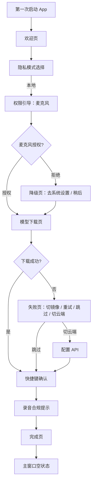
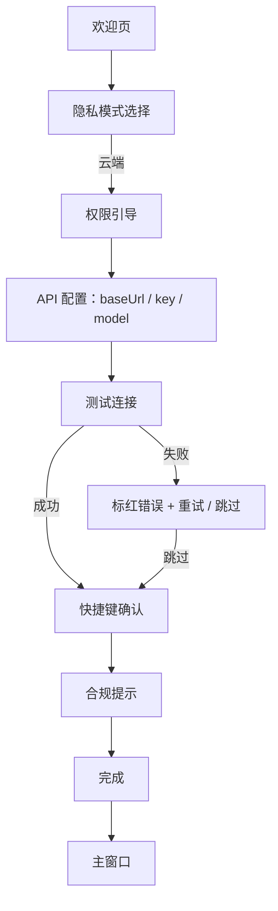
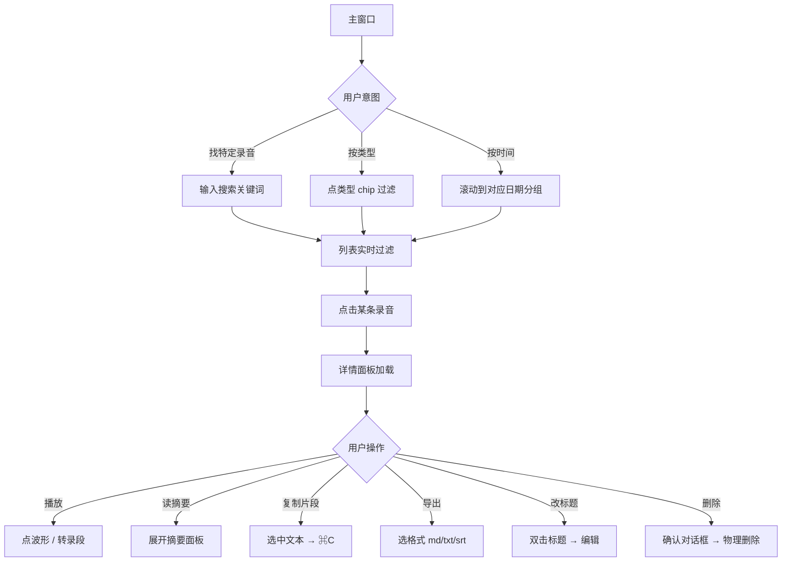

# LazyAudio 关键用户流程

> 版本 v0.1 — 2026-05-16
> 配套 [`information-architecture.md`](./information-architecture.md)
> 本文档列 v0.1 必须打磨的 5 个流程，含主路径 + 错误分支 + 状态机。

---

## 流程清单

| # | 流程 | 优先级 | 触发 |
|---|---|---|---|
| 1 | 首次启动 onboarding | P0 | 第一次打开 App |
| 2 | 一次完整录音 | P0 | 全局快捷键 / 菜单栏 |
| 3 | 查阅历史录音 | P0 | 打开主窗口 |
| 4 | 切换转录引擎（本地 ↔ 云端）| P1 | 设置页 |
| 5 | 错误恢复 | P0 | 各种失败状态 |

---

## 流程 1：首次启动 Onboarding

### 1.1 主路径（本地模式）



### 1.2 主路径（云端模式）



### 1.3 状态机

| 状态 | 允许操作 | 退出方式 |
|---|---|---|
| 欢迎 | 下一步 | — |
| 隐私模式 | 选本地 / 选云端 / 后退 | — |
| 权限引导 | 触发系统授权 / 稍后 | 拒绝 → 降级页 |
| 模型下载（本地）| 暂停 / 取消 / 切镜像 / 后退 | 完成自动前进 |
| API 配置（云端）| 填表 / 测试 / 跳过 | 测试通过自动前进 |
| 快捷键确认 | 录入新快捷键 / 用默认 | — |
| 合规提示 | "我已知晓"（必须点）/ "下次不提示"勾选 | — |
| 完成 | "开始录音" / 关闭 | 关闭 → 主窗口 |

### 1.4 设计要点

- **不能空着出去**：用户走完 onboarding，要么已下载本地模型、要么填了 API key（至少跳过了但知道未配置），不能让用户完成 onboarding 后才发现录不了音
- **跳过 = 显式**：每一步的"跳过"都明确告知后果（"暂时无法录音 / 转录"）
- **后退保留状态**：用户后退再前进，填过的字段保留

---

## 流程 2：一次完整录音

### 2.1 主路径

```mermaid
flowchart TD
  T1["快捷键 ⌘⇧R"] --> P1[录音前浮窗]
  T2["菜单栏 开始录音…"] --> P1
  P1 -->|确认| R[录音开始]
  R --> M1[菜单栏显示 ● 时长]
  M1 --> U{用户操作}
  U -->|暂停| Pa[暂停录音] --> U
  U -->|继续| R
  U -->|停止 / 再按 ⌘⇧R| S1[录音停止]
  R --> PA[Pass A 实时转录 utility 启动<br/>主窗口详情区段落实时追加<br/>hypothesis→confirmed]
  U -.->|每 10 分钟| PromptB[banner '对前 N 分钟跑离线精修?']
  PromptB -->|跑离线| PartialB[增量 Pass B 后台跑]
  PartialB -.->|覆盖对应段落| PA
  S1 --> S2[WAV 文件落盘]
  S2 --> StopPA[Pass A utility unload]
  StopPA --> S3[Pass B 任务入队 + fork offline utility]
  S3 --> T[Pass B 转录中]
  T --> T_done{Pass B 结果}
  T_done -->|成功| OverWrite[Pass B segments 覆盖 transcript.live<br/>UI 原地刷新，不弹通知]
  OverWrite --> Sum[自动套用 LLM 模板]
  T_done -->|失败| E[Pass B 失败：Pass A 段落保留<br/>列表项标失败，可重试]
  Sum --> Sum_done{摘要结果}
  Sum_done -->|成功| Done[就绪，主窗口列表顶部显示]
  Sum_done -->|失败| Done2[转录可用，摘要可手动重试]
  Done --> Notify[系统通知"已完成"]
  E --> Notify_err[系统通知"Pass B 失败"]
```

### 2.2 快捷键的双向语义

| 当前状态 | 按 `⌘⇧R` | 结果 |
|---|---|---|
| 空闲 | 弹录音前浮窗 | 浮窗确认 → 录音 |
| 录音中 | （无浮窗）直接停止并保存 | 文件落盘 + 转录入队 |
| 浮窗中 | 等同 Enter | 立即开始录音 |
| 暂停中 | 停止并保存 | 与录音中相同 |

> 设置中可勾选"快捷键直接开始录音，跳过浮窗" —— 适合熟手 / 笔记场景。

### 2.3 关键时机性能预算

| 节点 | 目标 |
|---|---|
| 快捷键触发 → 浮窗显示 | < 100 ms |
| 浮窗确认 → 录音开始（首个 sample 落盘） | < 400 ms |
| 录音停止 → WAV 完整落盘 | < 1 s（依赖时长） |
| WAV 落盘 → 列表项出现 | < 200 ms |
| 列表项出现 → 转录开始（worker 启动） | < 2 s |

### 2.4 边界情况

| 情况 | 行为 |
|---|---|
| 用户在录音中关主窗口 | 仅最小化到菜单栏，录音继续 |
| 用户在录音中按 `⌘Q` | 弹确认对话框 "录音将停止并保存，确定退出？" |
| 用户在录音中拔耳机 / 切音频设备 | 继续用新默认设备，主窗口顶部 toast "音频设备已切换" |
| 磁盘空间 < 500 MB | 录音前浮窗禁用"开始"按钮，提示 |
| 麦克风权限被撤回 | 浮窗内告知 + 直接打开系统设置链接 |
| 系统休眠 / 锁屏 | 录音继续；唤醒后无缝（macOS 14+ 验证） |

### 2.5 暂停 vs 停止

- **暂停**：状态保留，菜单栏 `‖ 03:24`（不脉冲、灰化），文件未落盘
- **停止**：录音结束，文件落盘，进入转录管线

二者不混用：暂停不会生成 WAV，停止不能再恢复。

---

## 流程 3：查阅历史录音



### 3.1 搜索行为

- 全文搜索 = 标题 + 转录正文（不搜摘要，避免噪声）
- 实时过滤（防抖 200 ms）
- 命中项在结果里**高亮关键词**
- 结果排序：标题命中 > 转录命中；同类按时间倒序

### 3.2 转录文本与音频的双向锚定

- 点转录任一段 → 音频跳到 `segment.start`，自动播放
- 音频播放 → 转录当前段加粗 + 自动滚到视口内
- 当前段在视口中央偏上 1/3（阅读舒适区）

### 3.3 错误状态在详情里的表现

| 状态 | 详情区显示 |
|---|---|
| 转录中 | 占位骨架屏 + "转录中… 34%" + 取消按钮 |
| 转录失败 | 错误信息 + "重试"按钮 + 链接到错误诊断 |
| 摘要中 | 摘要面板骨架屏 |
| 摘要失败 | "生成失败，[重试] [换模板]" |
| 无摘要（云端未配置）| 占位 + "去设置中配置 API"链接 |

---

## 流程 4：切换转录引擎

### 4.1 本地 → 云端

```mermaid
flowchart TD
  A[设置 - 转录引擎] --> B[选择"云端"]
  B --> C{已配置 API?}
  C -->|是| D[切换生效 + 提示]
  C -->|否| E[配置表单]
  E --> F[测试连接]
  F -->|成功| D
  F -->|失败| G[标红 + 错误信息]
  G --> E
  D --> H[关闭设置]
```

### 4.2 云端 → 本地

```mermaid
flowchart TD
  A[选择"本地"] --> B{已下载默认模型?}
  B -->|是| C[切换生效]
  B -->|否| D[提示下载]
  D --> E[模型下载页]
  E --> F{下载成功?}
  F -->|是| C
  F -->|否| G[保留云端模式]
```

### 4.3 切换影响

- **不重转旧录音**：切换只影响之后的新录音
- **可强制重转**：旧录音的"重新转录"按钮永远走当前引擎
- **混合存储**：meta.json 记录 `transcribeEngine` 字段，列表可显示用了哪个引擎（debug 用，UI 不强调）

---

## 流程 5：错误恢复

### 5.1 错误分类与处理矩阵

| 错误 | 触发时机 | 用户感知 | 恢复操作 |
|---|---|---|---|
| 麦克风被拒 | 录音浮窗 / 系统层 | 浮窗禁用"开始"按钮 + 红色提示 | "打开系统设置"深链 |
| 屏幕录制被拒（仅 < 14.2 版本）| — | v0.1 直接不支持 < 14.2 | — |
| 磁盘空间不足 | 录音前 / 录音中 | toast + 浮窗禁用 | 提示清理空间 |
| 模型下载失败 | onboarding / 设置 | 标红进度条 + 4 选项 | 切镜像 / 重试 / 跳过 / 切云端 |
| 模型文件损坏（SHA256 不匹配）| 下载结束 | 自动重下 + 用户可见 | 自动重试 1 次，仍失败显式报错 |
| 转录 worker 崩溃 | 转录中 | 列表项标失败 | 自动重试 1 次 + 用户可手动重试 |
| API 错误（401 / 429 / 5xx） | 转录中 / 摘要中 | 列表项 / 摘要面板标失败 | 重试按钮 + 链接到设置 |
| 网络断开 | 云端模式录音结束触发转录 | 任务入队，等网络 | 网络恢复自动重试 |
| 录音文件写入失败 | 录音中 | 致命错误 toast + 强制停止 | 报错 + 保留已写入部分 |
| App 崩溃 | 任意时机 | 重启后自动检查 | 启动时扫描"未完成"录音目录，标记 + 恢复转录 |

### 5.2 错误文案原则

1. **说人话**：不暴露 HTTP code / 堆栈，但有"展开技术详情"
2. **告诉用户下一步**：每个错误必须配至少 1 个可点击的恢复操作
3. **不要瞎乐观**：失败就是失败，不写"出了点小问题"这种掩饰
4. **保留现场**：可点击"复制错误信息"用于反馈

具体文案在 design-system.md 里固化模板。

### 5.3 崩溃恢复

LazyAudio 启动时扫描 `recordings/`：

- 有 `mic.wav` / `system.wav` 但缺 `meta.json` → 视为崩溃前未完成录音，生成最小 meta.json + 标"恢复"徽章
- 有 meta.json 但 `transcribeStatus = running` → 重置为 `pending`，进入下次转录队列
- 完整记录无变化

---

## 附录：与 PRD 的对应

| 流程 | PRD 章节 | 功能 ID |
|---|---|---|
| 1 onboarding | §5.1 | F6.1–F6.6 |
| 2 录音 | §5.2 | F1–F4 |
| 3 查阅 | §5.3 | F5 |
| 4 切换引擎 | §4.1 onboarding 异常 + §设置 | — |
| 5 错误恢复 | §11 风险 | 全局 |
