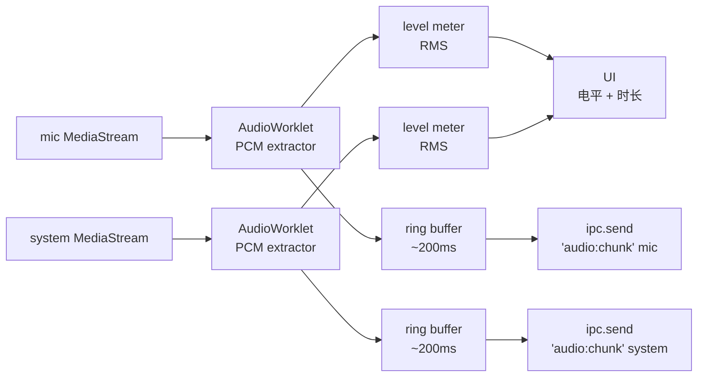

# 音频采集与录音落盘

> **版本**：v0.1-draft
> **日期**：2026-05-16
> **状态**：03-architecture 阶段；与 [`overview.md`](./overview.md) §2 / §4 衔接
> **依赖**：[`../01-research/tech-feasibility.md`](../01-research/tech-feasibility.md) R1 / R2 / R5 / R6 已通过 spike

---

## 0. 这份文档解决什么

`overview.md` 说了"renderer 抓音、main 落盘"。这份文档把以下细节说死：

- mic / system 两路音频在 macOS / Windows 上各自怎么抓
- 从 MediaStream 到 .wav 文件中间的处理管线
- 跨进程怎么把 PCM 流喂到主进程
- WAV 文件格式 / 分轨 / 混音的具体策略
- 权限、错误恢复、长录音稳定性怎么落

**不解决**：转录、UI 状态展示、文件命名 / meta（在 transcription-pipeline.md / data-model.md）。

---

## 1. 设计目标速查

| 目标                                                         | 来源                 | 落地手段                                                                                                                             |
| ------------------------------------------------------------ | -------------------- | ------------------------------------------------------------------------------------------------------------------------------------ |
| 仅需麦克风权限（macOS）                                      | PRD §7.4             | Electron 35+ desktopCapturer 走 CoreAudio Tap                                                                                        |
| 跨平台同一份采集代码                                         | PRD §3 / §7.4        | renderer 侧统一用 `getUserMedia + desktopCapturer`，平台差异藏在 Electron 抽象里                                                     |
| 边录边写，崩溃只丢崩前几秒                                   | PRD §11              | renderer 用 AudioWorklet 出 PCM chunk → IPC 流给主进程 → 主进程 append WAV                                                           |
| 快捷键 → 浮窗可见 < 100 ms                                   | PRD §7.1 / §5.2 拆解 | 浮窗常驻隐藏，快捷键 callback 仅 `.show()`                                                                                           |
| 浮窗回车 → 第一帧 PCM 落盘 < 400 ms                          | PRD §7.1 拆解        | audio graph 在浮窗显示时已预热（worklet 加载、port 建链）；`getUserMedia` 调用阻塞主路径                                             |
| 同时输出分轨 + 混音                                          | PRD §4.1 F3.1        | mic.wav / system.wav 直接由 PCM 流落盘；mixed.wav **录完后合成**（不实时混）                                                         |
| 录音中 CPU < 5%（主进程）                                    | PRD §7.1             | AudioWorklet（非 ScriptProcessor）；主进程纯字节 append，不解码不重采样                                                              |
| **PCM 同时喂 wav 落盘 + Pass A streaming ASR**（Multi Pass） | PRD §4.1 F4.6        | 主进程在 PCM 收到后 fork 一份给 streaming utility（48k→16k mono mix 在 main 做后转发），与 wav append 并行；fork 失败不影响 wav 落盘 |

---

## 2. 采集 API 选型

### 2.1 系统音

**结论**：用 Electron 内置的 `desktopCapturer` + `getUserMedia`，**不写 native addon**。

macOS / Windows 在 Electron 35+ 上共用同一份调用代码，底层 API 由 Electron 自动选：

| 平台            | Electron 实际走的 API                                           | 权限       |
| --------------- | --------------------------------------------------------------- | ---------- |
| macOS 14.2+     | CoreAudio Tap (`AudioHardwareCreateProcessTap`)                 | 仅麦克风   |
| macOS < 14.2    | **不支持**（PRD §7.4 已排除）                                   | —          |
| Windows 10 / 11 | WASAPI loopback (`IAudioClient` `AUDCLNT_STREAMFLAGS_LOOPBACK`) | 无额外权限 |

```ts
// renderer 侧统一调用
const sources = (await navigator.mediaDevices.getDisplayMedia) ? null : null
// 实际代码走 ipc 请到 main 的 desktopCapturer：
const sources = await ipc.invoke('audio:list-system-sources')
const systemStream = await navigator.mediaDevices.getUserMedia({
  audio: { mandatory: { chromeMediaSourceId: sources[0].id } },
  video: false, // 关键：明确拒掉视频
})
```

> `desktopCapturer.getSources` 只能在主进程调用，所以 renderer 通过 IPC 拿到 source id。这是 §6 IPC 协议要列出的第一组消息。

为什么不自己写 native addon：

- Electron 已经把 CoreAudio Tap / WASAPI loopback 都包好了，自己写 = 两个平台的维护负担 + 签名复杂度
- 把"系统音"这件事留在 web 标准（MediaStream）这一层，可以让"麦克风 / 系统音"在 renderer 走完全一样的 AudioWorklet 管线
- Plan B：万一上线后发现 Electron 抽象在某些设备组合下不稳，再退到 native addon（参考 `audiotee` / WASAPI 自写），见 §11

### 2.2 麦克风

```ts
const micStream = await navigator.mediaDevices.getUserMedia({
  audio: {
    echoCancellation: false, // 见 §2.3
    noiseSuppression: false,
    autoGainControl: false,
    channelCount: 1, // mic 默认单声道
    sampleRate: 48000, // 与 system 对齐
  },
  video: false,
})
```

### 2.3 不开 Chromium 的 echoCancellation / NS / AGC

| 默认值                 | LazyAudio 设置 | 原因                                                                                                                                           |
| ---------------------- | -------------- | ---------------------------------------------------------------------------------------------------------------------------------------------- |
| echoCancellation: true | **false**      | 用户开会用扬声器外放时，echoCancel 会把"系统音里的对方说话"识别成回声从 mic 里滤掉——但我们恰恰要这份内容。分轨场景下回声不是问题（分别成轨）。 |
| noiseSuppression: true | **false**      | 设置里给开关，默认关。NS 会损质量、影响转录准确度，且不可逆。                                                                                  |
| autoGainControl: true  | **false**      | AGC 会让电平表跳得不直观，且会模糊"对方说话音量"信息。                                                                                         |

权衡：用扬声器开会 + 不开 echo 会让 mic 里混入对方的声音。但这正是分轨的意义——转录侧可以根据 `system.wav` 的相同段做 dedup（v0.2+），v0.1 不处理。

### 2.4 采样率与声道

| 路     | 采样率   | 声道        | 位深       |
| ------ | -------- | ----------- | ---------- |
| mic    | 48000 Hz | 1（mono）   | PCM 16-bit |
| system | 48000 Hz | 2（stereo） | PCM 16-bit |
| mixed  | 48000 Hz | 2（stereo） | PCM 16-bit |

- 48 kHz 是 macOS / Windows 桌面音频的内部默认，不重采样省 CPU、避免 mic↔system 漂移
- 16-bit PCM：sherpa-onnx 输入要求 16k mono float，转录侧再降采样；存盘保留 48k/16-bit 是为了"原始素材尽量保真"
- 不直接存 32-bit float WAV：体积是 16-bit 的 2 倍，1 小时 stereo 从 ~660 MB 涨到 ~1.3 GB，不值

---

## 3. 渲染端管线

### 3.1 总览



### 3.2 AudioWorklet 而不是 MediaRecorder

| 选项                               | 选不选 | 原因                                                                                       |
| ---------------------------------- | ------ | ------------------------------------------------------------------------------------------ |
| `MediaRecorder` → opus/webm chunks | 否     | 输出是 webm/opus，不是 PCM。再解码会让 WAV 二次失真。chunk 边界对 sherpa-onnx VAD 不友好。 |
| `ScriptProcessorNode`              | 否     | 已废弃；运行在主线程，长录音卡顿。                                                         |
| **`AudioWorklet`**                 | **是** | 跑在 audio render thread，Float32 PCM 直出；可控制 chunk 粒度；CPU 占用低。                |
| `getCapturedTracks` + WebCodecs    | 否     | API 还在演进，跨平台一致性差。                                                             |

### 3.3 AudioWorklet processor 草案

实际源码位置：`src/renderer/audio/worklets/pcm-tap.worklet.ts`（`.worklet.ts` 后缀让 Vite 把它单独编译成 chunk，渲染时通过 `audioWorklet.addModule(url)` 加载）。

```ts
// src/renderer/audio/worklets/pcm-tap.worklet.ts
class PCMTap extends AudioWorkletProcessor {
  process(inputs) {
    const input = inputs[0] // 1~2 channels of Float32Array, length 128
    // 拼装到内部 buffer，每 4800 samples (~100ms @48k) post 一次
    // ...
    this.port.postMessage({ pcm: chunk, sampleRate, channels, ts: currentTime })
    return true // 保持存活
  }
}
registerProcessor('pcm-tap', PCMTap)
```

- chunk 粒度选 **100 ms** 一次（4800 samples @ 48k）：
  - 太小 → IPC 频率高，主进程压力大
  - 太大 → 电平表卡，停止录音时尾部丢得多
- 在 worklet 里**同时算 RMS** 给电平表，避免主线程再扫一遍

### 3.4 Float32 → Int16

转换在 worklet 里做，再发 IPC：

```ts
function f32ToI16(f32) {
  const out = new Int16Array(f32.length)
  for (let i = 0; i < f32.length; i++) {
    const s = Math.max(-1, Math.min(1, f32[i]))
    out[i] = s < 0 ? s * 0x8000 : s * 0x7fff
  }
  return out
}
```

IPC 上传 Int16 = 一半字节数，省 IPC 拷贝。

---

## 4. IPC：PCM 流到主进程

### 4.1 协议草案

| 方向            | 通道                 | payload                                                                       |
| --------------- | -------------------- | ----------------------------------------------------------------------------- |
| renderer → main | `audio:track-open`   | `{ recordingId, trackId: 'mic' \| 'system', sampleRate, channels, bitDepth }` |
| renderer → main | `audio:chunk`        | `{ recordingId, trackId, seq, pcm: ArrayBuffer, ts }`                         |
| renderer → main | `audio:track-close`  | `{ recordingId, trackId, reason }`                                            |
| main → renderer | `audio:writer-ack`   | `{ recordingId, trackId, bytesWritten, lastSeq }`                             |
| main → renderer | `audio:writer-error` | `{ recordingId, trackId, error }`                                             |

正式 schema 见 [`ipc-contract.md`](./ipc-contract.md)（待写）。

### 4.2 用哪个 IPC

- **`MessageChannel`（postMessage with `transfer`）**，**不用** `ipcRenderer.send(channel, data)`。
- 理由：`postMessage` 支持 transferable，把 ArrayBuffer 所有权移交主进程，零拷贝；`ipcRenderer.send` 是结构化克隆，1 小时录音的 PCM 总量~660 MB，克隆成本太高。
- 实现：app 启动时主进程 `webContents.postMessage('audio-port', null, [port])` 把 MessagePort 推给 renderer，后续 PCM 走该 port。

### 4.3 背压

100 ms 一帧 × 2 路 = 20 msg/s，单路 PCM ~19 KB，总带宽 ~770 KB/s。Electron MessagePort 完全 hold 得住。但要做兜底：

- renderer 维护一个 ring buffer（最大 2 秒）；如果发现 `audio:writer-ack` 落后超过 1 秒 → renderer 调 `record:report-warning { code: 'disk-slow' }`（invoke）；主进程汇总后广播 `record:warning` 事件给所有窗口
- ring buffer 满则**丢老不丢新**，每次丢弃 renderer 调 `record:report-warning { code: 'pcm-dropouts', detail: { ms } }`；主进程追加到 `meta.warnings` + 广播 `record:warning`（v0.1 仅记录不修复）
- 检测的权威源是 renderer——它知道自己发了多少、收到多少 ack；主进程不主动比对（避免双重判定）。`record:report-warning`（renderer→main invoke）与 `record:warning`（main→renderer 事件）的方向区分详见 [`ipc-contract.md`](./ipc-contract.md) §2.1 / §2.2

### 4.4 PCM fork 到 Pass A streaming utility（Multi Pass）

PRD F4.6：录音中 Pass A streaming utility 需要持续吃 PCM 出实时转录。主进程是 PCM 的唯一接收方，因此 fork 由主进程做，**对 audio-capture renderer 完全透明**：

```
[renderer worklet] ── PCM (Int16, 48k stereo/mono per track) ──► [main]
                                                                  │
                                                  ┌───────────────┼────────────────┐
                                                  ▼               ▼                ▼
                                          [wav append]     [downmix 16k mono]   [record:tick]
                                                                  │
                                                                  ▼
                                              [post to Pass A utility via MessagePort]
                                                                  │
                                                                  ▼
                                                        [Pass A: streaming ASR]
```

**关键细节**：

- **downmix 48k stereo → 16k mono** 在主进程做（sherpa-onnx 输入要 16k mono）；mic 已经 mono 只需下采样，system 是 stereo 要先 L+R/2 再下采样
- **下采样器**：复用 transcription-pipeline §3.4 决策——首选 sherpa-onnx-node Resampler，回退自写 polyphase。两个 utility 共享同一份 binary，所以本来就在主进程能访问到
- **fork 失败不阻塞 wav 落盘**：streaming utility 崩溃 / 启动失败 → main 标记 `meta.liveTranscribe.status='failed'` + 广播 IPC，wav append 继续；Pass B 在录音 stop 后仍照常跑
- **Pass A utility 的 PCM 通道**：独立 MessageChannel（不复用 renderer→main 的 audio port），main 是发送方；payload `{ pcm: Int16Array, ts }`，transferable
- **mic + system 两轨送同一 Pass A 还是各自一份**：v0.1 简化——**只送 mic + system 混音**给 Pass A（与 Pass B 用分轨不一样）。理由：streaming engine 通常单声道 + 单 speaker 假设，多轨会让 hypothesis 跳变更频繁；Pass B 用分轨补回精度。spike-011 验证后可能改

---

## 5. 主进程：WAV 流式落盘

### 5.1 Writer 结构

```
RecordingSession (per recordingId)
├── micWriter:    WavStreamWriter('mic.wav',    48000, 1, 16)
├── systemWriter: WavStreamWriter('system.wav', 48000, 2, 16)
└── meta.json （边录边更新 duration / status）
```

`WavStreamWriter` 内部：

1. `open()`：写 44 字节 WAV header **占位**（`RIFF size` / `data size` 写 0 占位，不写 0xFFFFFFFF）
2. `write(pcmInt16)`：直接 `fs.write` append 到文件，**不缓存到 RAM**
3. **每 30 秒**：`pwrite(header bytes, offset=0)` 把当前真实 size 回填——成本是 `pwrite(8 bytes, offset=4) + pwrite(4 bytes, offset=40)` × 0.033 Hz，可忽略
4. `close()`：再次回填 header，确保最终精确

**为什么周期 flush 而非占位 0xFFFFFFFF**：

- 0xFFFFFFFF 在多数解码器里行为不统一：部分 reject，部分截到 4 GB 边界，部分按"未知到 EOF"读
- 崩溃后用户用 Finder / VLC / Audacity 打开 wav 是常见诉求——周期 flush 让"已落盘部分大部分时间立即可播放"，符合"边录边写"的真正价值
- 30s 窗口下崩溃最坏丢的是 size 字段未刷的那 0~30s——但 PCM 数据完整，§5.3 启动恢复仍能精确回填

### 5.2 WAV header 字段

```
Offset  Field             Value
0       "RIFF"            chunk id
4       <size>            36 + dataSize, close 时回填
8       "WAVE"
12      "fmt "
16      16                fmt chunk size (PCM)
20      1                 PCM format
22      channels          1 (mic) / 2 (system)
24      sampleRate        48000
28      byteRate          sampleRate * channels * 2
32      blockAlign        channels * 2
34      16                bitsPerSample
36      "data"
40      <dataSize>        close 时回填
44      <pcm bytes...>
```

### 5.3 崩溃恢复

录音中主进程 / 整机崩溃，结果是：

- 文件存在
- header 的 size 字段是**上次周期 flush 时的值**（最多落后 30s）
- data 内容到崩溃点都在盘上

启动时扫描 `recordings/`：

1. 任意 `meta.json` 状态是 `recording` / `stopping` → 进入恢复
2. 读对应 `.wav` 文件实际大小，反推真实 dataSize 精确回填 header
3. 更新 `meta.status = recovered`，`durationMs` 按文件大小重算
4. UI 列表里这条录音标"已恢复（崩溃于 03:24）"

**最坏丢失**：崩溃前未 `fs.write` 完的 ring buffer，最多 100~200 ms。崩溃后立即用第三方播放器打开 wav，最多看到 size 比实际短 30s（多数播放器会读到 EOF 自动延长，无感知差异）。

### 5.4 不用 Node `stream.Writable` 的 backpressure 机制

考虑过用 `createWriteStream` + drain 事件做背压，否决了：

- 文件写本质是 OS 缓冲，drain 几乎不触发；用户态再叠 backpressure 是迷信
- 实际瓶颈在 disk fsync——v0.1 不主动 fsync，依赖 OS 默认行为
- 错误处理上 `fs.write` 直接 try/catch 比 stream 'error' 事件好定位

---

## 6. 混音（mixed.wav）

PRD §4.1 F3.1：**混音始终生成，分轨可关**。

### 6.0 与录音状态机的关系

混音是**独立子状态机**（`meta.mixStatus`），**不**阻塞录音主状态机：

- `status: stopping → done` 在 writers close 时立即触发——用户停止后**立即看到录音出现在列表里**
- 混音异步在后台跑（`mixStatus: pending → running → done` 或 `failed`）
- 列表项**不**显示混音状态（用户不关心）；详情页里若 `mixStatus !== done` 时显示"混音中…"或"混音失败 [重新生成]"
- 转录使用分轨而非 mixed，因此 mixStatus 不阻塞 transcribe 子状态

### 6.1 时机：录完后离线合成

不实时混的理由：

- 录音中两路是独立的 audio context，合成会引入跨 worklet 同步；离线合成简单可靠
- 万一一路崩了另一路还在，不会污染合成结果
- 离线合成可以做轻量 limiter / normalize；实时做要算 RMS 跨帧很麻烦

### 6.2 实现

录音 `stopping` 状态时主进程异步触发：

```
1. 打开 mic.wav, system.wav 两个 reader
2. 创建 mixed.wav writer (48000, 2, 16-bit)
3. 逐 frame 读：
   - micFrame: mono → 复制到 L 和 R
   - sysFrame: stereo as-is
   - mix = clamp((mic_mono + sys_L)/2, ...), clamp((mic_mono + sys_R)/2, ...)
4. 关闭 writer
5. 更新 meta.audioFiles.mixed = 'mixed.wav'
```

**注意**：

- 简单 **平均** 而不是直接 sum，避免削顶
- 不做对齐 / 漂移补偿；spike-005 量化漂移 < 50 ms（PRD §5 验证项），人耳基本不可察觉。一旦实测漂移超 100 ms 再补对齐逻辑。
- 用户在设置里关分轨时：mic.wav / system.wav 在合成完后删除

### 6.3 失败处理

合成失败（IO 错 / 中途断）不影响录音"已完成"状态：

- meta.audioFiles.mixed = null + meta.warnings.push('mix-failed')
- UI 在详情里显示"重新生成混音"按钮
- 转录用分轨而不用 mixed，所以混音失败不阻塞下游

---

## 7. 权限

### 7.1 macOS

| 权限                      | 何时请求                                                                  | 不给的话                                          |
| ------------------------- | ------------------------------------------------------------------------- | ------------------------------------------------- |
| 麦克风                    | onboarding 步骤 3；首次实际调用 `getUserMedia({audio:true})` 触发系统弹窗 | 录音失败，UI 引导用户到"系统设置 > 隐私 > 麦克风" |
| 辅助功能（Accessibility） | onboarding 步骤 3                                                         | 全局快捷键失效，但点菜单栏仍可开始录音            |
| 屏幕录制                  | **不请求**                                                                | —                                                 |

如果用户在 macOS 14.0–14.1：onboarding 检测后直接显示"系统版本不支持"页面（PRD §7.4），不让进入主流程。

> **依赖 02-design 未补齐**：当前 `docs/02-design/user-flows.md` §1 / `information-architecture.md` §6 的 onboarding 流程图**没有**版本检查这一屏（应作为欢迎页之前的"屏 0"）。架构层把这条要求记录在此，02-design 在 v0.1 dogfood 前需补一屏：不达标 → 显示退出提示 + 升级链接，不进 main onboarding。

### 7.2 Windows

- 麦克风：Windows 10/11 "麦克风访问权限" 设置；首次 `getUserMedia` 触发系统提示
- 系统音：无额外权限

### 7.3 权限丢失中途的处理

录音中用户主动撤销麦克风权限（极端但可能）：

- `MediaStream` 的 audio track 触发 `ended` 事件
- renderer 通知主进程 `audio:track-close { reason: 'permission-revoked' }`
- 主进程：保留已录部分、关闭 writers、状态 → failed-partial、UI 红条警告

---

## 8. 与录音状态机的衔接

录音状态机在主进程（详见 [`overview.md`](./overview.md) §4.2）。本文档负责"采集相关"的状态迁移触发：

| 触发                         | 来源      | 状态迁移                                                           |
| ---------------------------- | --------- | ------------------------------------------------------------------ |
| 录音前浮窗"开始"             | renderer  | `idle → preparing`                                                 |
| 两路 `audio:track-open` 收到 | main      | `preparing → recording`（第一帧 `audio:chunk` 到达）               |
| 录前 30 秒拿不到第一帧       | main 超时 | `preparing → failed`                                               |
| 用户 pause                   | renderer  | `recording → paused`；renderer 暂停 worklet 发送，writers 不关     |
| 用户 resume                  | renderer  | `paused → recording`；记录 gap，混音时不补 silence（保留真实暂停） |
| 用户 stop                    | renderer  | `recording → stopping`                                             |
| 两路 writers close 完        | main      | `stopping → done`；触发混音；触发转录任务入队                      |

### 8.0 外部事件 → 状态机转移

录音中可能遇到的外部事件（设备热切换、系统 Sleep、权限撤销）统一映射如下：

| 事件                                  | 来源     | 期望转移                                                                                              | 用户感知                                         |
| ------------------------------------- | -------- | ----------------------------------------------------------------------------------------------------- | ------------------------------------------------ |
| `MediaStreamTrack.mute`               | renderer | recording → paused（**自动**）                                                                        | UI 顶部 toast "音频中断，等待恢复"               |
| `MediaStreamTrack.unmute`             | renderer | paused → recording（**自动**）                                                                        | toast 消失                                       |
| `MediaStreamTrack.ended`（设备拔出）  | renderer | 尝试 re-getUserMedia 新默认设备 → 成功则续录（同 wav writer 续写）；失败 → stopping → done（partial） | toast "已切换到 {新设备}" / "设备不可用，已停止" |
| `MediaStreamTrack.ended`（权限撤销）  | renderer | stopping → failed-partial                                                                             | 红条 "麦克风权限被撤销，录音已停止"              |
| `powerMonitor.suspend`（macOS Sleep） | main     | recording → paused；writers 不 close                                                                  | 唤醒后自动 resume                                |
| `powerMonitor.resume`                 | main     | paused → recording                                                                                    | —                                                |
| `app before-quit` 录音中              | main     | 拦截，弹"录音中，确认退出会停止？"对话框                                                              | PRD §7.3                                         |

**`ended` 区分"设备拔出" vs "权限撤销"** 的判定：

1. 调一次 `navigator.permissions.query({ name: 'microphone' })`
2. 状态 'denied' → 权限撤销
3. 否则 → 设备问题，尝试 re-getUserMedia 新默认设备

### 8.1 pause 的语义

PRD §4.1 F2.3 说支持暂停 / 继续。两种语义：

| 语义                                                  | LazyAudio v0.1                                         |
| ----------------------------------------------------- | ------------------------------------------------------ |
| A. 停止采集，pcm 缺一段 → 文件时长 < 实际录制墙钟时间 | **采用**                                               |
| B. 静音填充，文件时长 = 墙钟时间                      | 否决：会让"暂停 10 分钟咖啡时间"产出 10 分钟空白浪费盘 |

实现：pause 时 worklet `port.close()` 或 main 端 `pauseAccept`，resume 时重开。meta.json 记录 `pauseSegments: [{startMs, endMs}]`（v0.2 可用来跳回录音时刻）。

---

## 9. 长录音稳定性（PRD §11 / R6）

PRD 风险点 R6：长录音 2-3h 的稳定性。本文档的设计已经回答了大部分：

| 关注点                                  | 回答                                                                                                |
| --------------------------------------- | --------------------------------------------------------------------------------------------------- |
| 内存累积                                | renderer ring buffer 上限 ~2s；主进程不缓存 PCM 直接 append；无累积                                 |
| 磁盘 I/O                                | 流式 append，每 100 ms ~ 19 KB × 2 路，常规 SSD 远未饱和                                            |
| 文件大小                                | 2h 48k stereo 16-bit ≈ 1.4 GB；接受；v0.2 可选 opus/m4a 压缩                                        |
| 崩溃                                    | §5.3 已说                                                                                           |
| 系统睡眠 / 屏保 / 设备热切换 / 权限撤销 | 全部进 §8.0 状态机表，由 `MediaStreamTrack.mute/unmute/ended` 与 `powerMonitor.suspend/resume` 驱动 |

---

## 10. 启动时的预热

为了满足拆分后的两条预算：

```
app 启动后空闲时（idle callback）
  ├─ renderer 'prep' window：
  │   ├─ AudioContext 创建（不 start）
  │   ├─ AudioWorklet module 加载
  │   └─ MessagePort 与 main 建链
  └─ main：
      ├─ 预查询 desktopCapturer sources，缓存（每 30s 失效）
      └─ writers 模板就绪
```

两阶段实测目标（spike-010 量化）：

| 阶段                                  | 触发 → 完成                                                                                          | 预算         |
| ------------------------------------- | ---------------------------------------------------------------------------------------------------- | ------------ |
| 阶段 1：快捷键 keydown → 浮窗 visible | globalShortcut callback → `prepWindow.show()` 同步返回                                               | **< 100 ms** |
| 阶段 2：浮窗 Enter → 第一帧 PCM 落盘  | renderer click handler → getUserMedia × 2 → worklet pipe → 主进程收到第一个 audio:chunk → 写文件成功 | **< 400 ms** |

合计 < 500 ms（PRD §7.1 用户感知预算）。

**注意**：`skipPrepPopover=true` 模式下没有阶段 1 的"等用户回车"，但仍要走 getUserMedia → worklet → 第一帧落盘，预算等同阶段 2（< 400 ms）。

---

## 11. Plan B 清单

按"越往下越伤"排序，万一上线发现问题：

1. **echoCancellation 抱怨多** → 设置里加开关，默认仍关
2. **CoreAudio Tap 在蓝牙耳机 + 外接声卡组合下行为怪** → 设置里加"切回 ScreenCaptureKit"开关，附带"需要屏幕录制权限"提示
3. **Electron desktopCapturer 在 Windows 11 触发 [#46369](https://github.com/electron/electron/issues/46369)** → 写 WASAPI loopback 的 N-API addon（参考 naudiodon），仅 Windows 装该 addon
4. **Mic/system 漂移 > 100 ms** → 主进程加入 timestamp-based resample 对齐，混音前补偿
5. **WAV 太大** → 录音结束后可选 opus 转码并保留 wav 7 天

---

## 12. 开放问题

- **多输出设备同时 active**（蓝牙 + 内置扬声器 mirroring）时 CoreAudio Tap 抓哪一个？文档说"默认输出"，实测可能因人而异。
- **AGC 完全关掉后 mic 输入电平偏小**的用户是否需要软增益？v0.1 暂不做，留观察。
- **PCM chunk 粒度 100ms 是否最优**？延迟、IPC 成本、电平表手感的三角；spike 实测后定。
- **暂停期 worklet 是否完全停 vs 继续跑只是丢弃**：停可能让重新启动有几十毫秒空窗；丢弃浪费 CPU。倾向"继续跑+丢弃"，待实测。

> macOS Sleep / 屏保唤醒、设备热切换、权限撤销三件事已合并到 §8.0 状态机表，不再列为开放问题。

---

## 13. 出文档前的 spike 清单

进入 04-development M3 之前必须打勾：

- [ ] spike-001：macOS 双轨录音 30s WAV 可播放 + 仅麦克风权限
- [ ] spike-002：Windows 双轨录音 30s 不崩
- [ ] spike-005：mic / system 漂移量化，典型值 < 50 ms
- [ ] spike-010（新增）：快捷键延迟两阶段——keydown → 浮窗 visible < 100 ms，浮窗 Enter → 第一帧 PCM 落盘 < 400 ms
- [ ] AudioWorklet PCM tap 在 1h 录音中 CPU < 5%、内存不增长（开发阶段压测）

详细 spike 模板见 [`../01-research/tech-feasibility.md`](../01-research/tech-feasibility.md)。

---

## 14. 跨文档导航

| 想了解                                            | 看                                                         |
| ------------------------------------------------- | ---------------------------------------------------------- |
| meta.json / transcript.json / 录音目录字段        | [`data-model.md`](./data-model.md)                         |
| WAV 落盘后怎么进入本地 / 云端转录                 | [`transcription-pipeline.md`](./transcription-pipeline.md) |
| `audio:*` 系列 IPC 完整 schema                    | [`ipc-contract.md`](./ipc-contract.md)                     |
| 进程拓扑、状态机全景                              | [`overview.md`](./overview.md) §2 / §4                     |
| 关键决策（CoreAudio Tap、AudioWorklet、流式 WAV） | [`adr/`](./adr/) 待写                                      |
