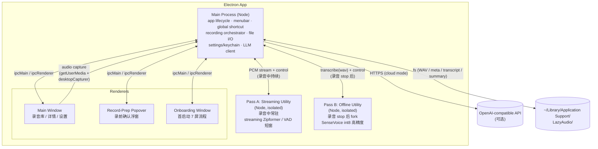
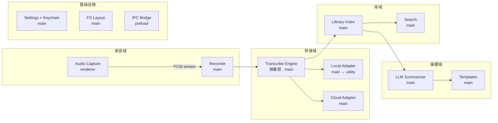

# LazyAudio 架构总览

> **版本**：v0.1-draft
> **日期**：2026-05-16
> **状态**：03-architecture 阶段的入口文档；细节在同目录其它文档中展开
> **配套**：[`audio-capture.md`](./audio-capture.md) · [`transcription-pipeline.md`](./transcription-pipeline.md) · [`data-model.md`](./data-model.md) · [`ipc-contract.md`](./ipc-contract.md) · [`adr/`](./adr/)

---

## 0. 这份文档是干什么的

- **是什么**：把"app 内部由哪些进程 / 模块组成，谁负责什么，数据怎么流"讲清楚，让人看一遍就能定位到任何后续文档。
- **不是什么**：不深挖采集 / 转录 / 存储 / IPC 协议的具体实现细节——那些有专门的文档。
- **读者**：自己（实施时定位用），以及未来的协作者。
- **前置**：已读 [`../01-research/prd.md`](../01-research/prd.md) §4 / §8 / §6（功能范围 / 技术约束 / 数据模型）。

---

## 1. 设计驱动力

PRD §3 已经把原则定下来了。落到架构上，有 5 条硬约束直接驱动结构：

| 约束                                                                           | 来源                          | 对架构的影响                                                                                                                                                                     |
| ------------------------------------------------------------------------------ | ----------------------------- | -------------------------------------------------------------------------------------------------------------------------------------------------------------------------------- |
| **本地优先**：默认数据不出本机                                                 | PRD §3.1                      | 没有"server"角色；云能力（LLM / 云转录）走可选 HTTP client，且 API key 进 keychain                                                                                               |
| **录音不可被意外中断 / 崩溃丢数据**                                            | PRD §7.3 / §11                | 录音落盘走主进程**流式 append**；renderer 崩溃最多丢崩前几秒，已落盘部分完好                                                                                                     |
| **转录不阻塞 UI、OOM 不拖垮 app**                                              | PRD §5.2 / §8                 | 本地 ASR 跑在独立 **utility process**，崩了主进程能感知并重启                                                                                                                    |
| **跨平台**：macOS 14.2+ / Windows 10+                                          | PRD §7.4                      | 系统音采集走 Electron 35+ `desktopCapturer` 抽象（macOS 自动选 CoreAudio Tap，Windows 自动选 WASAPI loopback），上层不分平台分支                                                 |
| **快捷键到开始录音 < 500 ms**（拆为：< 100 ms 浮窗可见 + < 400 ms 第一帧 PCM） | PRD §7.1 / audio-capture §1.1 | 录音前浮窗常驻（隐藏 BrowserWindow）；冷启动后预热 utility process 与 audio graph                                                                                                |
| **Multi Pass 实时转录**（v0.1 P0）                                             | PRD §4.1 F4.6–F4.9 / §7.1     | 录音中 streaming utility process 实时跑 Pass A（hypothesis→confirmed），录音结束后 offline utility 跑 Pass B 覆盖；两个 utility **不长期共存**，Pass B 启动前 Pass A 必须 unload |

---

## 2. 进程拓扑

LazyAudio 是一个标准 Electron 应用，**1 个主进程 + N 个 renderer + 1~2 个 utility process**（Multi Pass：streaming utility 在录音中跑，offline utility 在录音 stop 后跑；两者**不长期共存**——Pass A unload 后 Pass B 才 fork）。



### 2.1 各进程职责

#### 主进程（Main / Node）

- **窗口与生命周期**：创建 / 隐藏 / 销毁 BrowserWindow；菜单栏 Tray；macOS Dock；`app.requestSingleInstanceLock`
- **全局快捷键**：`globalShortcut` 注册 ⌘⇧R / Ctrl+Shift+R；触发"录前浮窗"
- **录音调度器（Recording Orchestrator）**：录音任务的状态机（idle → preparing → recording → paused → stopping → done / failed）拿在主进程，renderer 只是观察者
- **文件 I/O**：WAV 流式 append、meta.json / transcript.json / summary.md 读写、录音库目录扫描与索引
- **设置与 keychain**：settings.json 读写；macOS Keychain / Windows Credential Manager 存 API key
- **云能力 client**：OpenAI 兼容 API 调用（LLM 摘要、可选的云转录），统一从主进程发出，renderer 拿不到 key
- **utility process 管理**：fork ASR worker、健康检查、崩溃重启、任务派发

#### Renderer 进程（React / Vite）

3 个 BrowserWindow，共享同一份 React 代码 + 路由：

| 窗口                | 用途                                   | 显示策略                            |
| ------------------- | -------------------------------------- | ----------------------------------- |
| Main Window         | 录音库列表 + 详情面板 + 设置           | 用户唤起时显示；关闭只是隐藏        |
| Record-Prep Popover | 录前确认浮窗（会话类型 / 音源 / 开始） | **常驻隐藏**，快捷键时 ~50ms 内显示 |
| Onboarding          | 首启动 7 屏流程                        | 一次性，完成后关闭                  |

- **不做**：文件 I/O、keychain、HTTP 到云端
- **做**：
  - 用 `navigator.mediaDevices.getUserMedia` 抓 mic / system 音频
  - 把 PCM chunk 通过 IPC 流给主进程
  - UI 状态展示（录制时长、电平、转录进度、列表、详情）
  - 用户输入（搜索、重命名、模板切换、设置编辑）

#### ASR Utility Process（Multi Pass：streaming + offline 两个）

两个 utility process 都加载 **sherpa-onnx N-API addon**，但**不长期共存**——目的是把内存峰值压在 1.5 GB 以内（PRD §7.1 上限 2.5 GB，留 1 GB 给录音 + UI + utility 切换时短暂重叠）。

**Pass A（Streaming Utility）**：

- 录音 start 时 fork，录音中常驻
- 接收 PCM 流（从 main，audio-capture §4 fork 的副本）；按 spike-011 选型走 streaming Zipformer 或 VAD 短窗 SenseVoice
- 输出：`{ segmentId, start, end, text, stability: 'hypothesis' | 'confirmed', speaker }` 事件
- 录音 stop → main 发 `unload` → utility 自杀（释放模型内存）→ main 才 fork Pass B utility

**Pass B（Offline Utility）**：

- 录音 stop 后 fork（且 Pass A 已 unload）；或用户在 banner 点 "跑离线" 触发增量 Pass B
- 接收 `{ recordingId, wavPath, timeRange? }`（增量模式 timeRange = `[0, N*60s]`）
- 输出：完整 segments + 时间戳 + speaker；写完 → main 用 segments 整体覆盖 transcript.live.json 内容 → renderer UI 原地刷新
- 模型：SenseVoice int8（与 v0.1 r1-r4 单 pass 设计一致）

**隔离收益**：onnxruntime OOM / native crash 不影响主进程；Pass A 崩溃时 Pass B 仍可走通；可独立替换模型而不重启 app。

> macOS 上 sherpa-onnx 的动态库需要 `asarUnpack` + `@loader_path` + install_name_tool 改写——见 [`transcription-pipeline.md`](./transcription-pipeline.md) §3.2 / 待写 ADR-0002。两个 utility process **共用同一份 sherpa-onnx 二进制**（不需要为 Pass A / B 分别打包）。

### 2.2 为什么不是其它拓扑

| 候选                                  | 否决理由                                                                                                |
| ------------------------------------- | ------------------------------------------------------------------------------------------------------- |
| ASR 跑在 renderer                     | renderer 崩溃会同时丢 UI；GPU process / sandbox 限制下加载 native addon 麻烦                            |
| ASR 跑 `child_process.fork`           | 没有 Electron 提供的崩溃事件 / message port；utility process 是官方推荐                                 |
| 单一 BrowserWindow 切换路由代替多窗口 | "常驻隐藏"的录前浮窗 + "一次性"的 onboarding 用同一个 BrowserWindow 会让"显示/隐藏"语义乱掉，分开更干净 |
| 把云端能力放 renderer                 | renderer 拿不到 keychain；XSS / 第三方依赖一旦渗透 key 就漏了                                           |

---

## 3. 模块划分

按"领域"拆，每个模块标注它跨哪些进程。



### 模块速查表

| 模块                              |   主进程    |   Renderer   | ASR utility | 详见                      |
| --------------------------------- | :---------: | :----------: | :---------: | ------------------------- |
| App 生命周期 / 单实例             |      ●      |              |             | overview                  |
| 菜单栏 / 全局快捷键               |      ●      |              |             | overview                  |
| 窗口管理                          |      ●      |     (UI)     |             | overview                  |
| 音频采集（mic + system）          |   (权限)    |      ●       |             | audio-capture.md          |
| WAV 编码 / 落盘                   | ●（append） | (PCM source) |             | audio-capture.md          |
| 录音状态机                        |      ●      |   (观察者)   |             | audio-capture.md          |
| 转录引擎抽象                      |      ●      |              |             | transcription-pipeline.md |
| 本地转录（sherpa-onnx）           |   (调度)    |              |      ●      | transcription-pipeline.md |
| 云端转录（OpenAI 兼容）           |      ●      |              |             | transcription-pipeline.md |
| 模型下载 / 校验                   |      ●      |     (UI)     |             | transcription-pipeline.md |
| LLM 摘要 + 模板                   |      ●      |     (UI)     |             | transcription-pipeline.md |
| 录音元数据 / transcript / summary |      ●      |              |             | data-model.md             |
| 录音库扫描 / 索引 / 搜索          |      ●      |     (UI)     |             | data-model.md             |
| 设置 + Keychain                   |      ●      |     (UI)     |             | data-model.md             |
| IPC 协议                          |      ●      |      ●       |      ●      | ipc-contract.md           |

---

## 4. 关键数据流

### 4.1 一次完整的录音 → 实时转录 → 离线覆盖 → 摘要（Multi Pass）

```
[user]              [renderer]           [main]                [ASR_LIVE]  [ASR_OFF]  [cloud]
  │
  │  ⌘⇧R
  ├──────────────────────────────────► globalShortcut hit
  │                                     ├─ showPrepWindow() (内部)
  │                       ┌──────┐
  │                       │ prep │ ipc.invoke 'record:get-prep-defaults' → { sessionType, sources }
  │  确认 "开始录音"
  │  ───────────────────► │      │ ipc: record:start
  │                       └──────┘ ────► 创建 recordingId / dirs / meta.json
  │                                       打开 wav writers
  │                                       **fork Pass A utility** + ensureRecognizer
  │                                       建立 PCM fork port → Pass A
  │                       ┌──────┐
  │                       │getUM │ getUserMedia × 2 → AudioWorklet → Float32
  │                       │      │ ─── PCM chunks ───►
  │                       │      │                      ├─ wav append
  │                       │      │                      └─ fork to Pass A ────►  实时 ASR
  │                       │      │                                            │
  │                       │      │ ipc: transcribe:live-segment              │
  │                       │      │ { segmentId, text, stability: 'hypothesis' }
  │                       │      │ ◄─────────────────────────────────────────┤
  │                       │      │ (几秒后)
  │                       │      │ ipc: transcribe:live-segment
  │                       │      │ { segmentId, text, stability: 'confirmed' }
  │                       │      │ ◄─────────────────────────────────────────┤
  │                       └──────┘   渲染：原地替换 hypothesis → confirmed
  │
  │  ⌘⇧R / 停止
  ├──────────────────────────────────► ipc: record:stop
  │                                     关闭 writers + 生成 mixed.wav
  │                                     **kill Pass A utility (unload model)**
  │                                     等 Pass A 退出（~2s）
  │                                     **fork Pass B utility**
  │                                     ─────────────────────►  transcribe(wav, full)
  │                                                                          │  SenseVoice int8
  │                       ◄────────── transcribe:progress                    │
  │                                     ◄────────────────────────────────────┤  segments
  │                                     写 transcript.json
  │                                     **覆盖 transcript.live.json 的 UI 视图**
  │                       ◄────────── transcribe:offline-overwrite
  │                                                                                            │
  │                                     套对应模板 ─────────────────────────────────────────►  POST
  │                                     ◄───────────────────────────────────────────────────── summary
  │                                     写 summary.md
  │                       ◄────────── summary:done
```

**云模式 Multi Pass**（默认关）：

- Pass A：复用本地 streaming utility（必须装本地模型）；或用户主动启用云端切片上传 → 走 OpenAI 兼容 transcription API 切片 + 拼接
- Pass B：云端 API 一次性上传完整 WAV（mp3 转码后），verbose_json 拿 segments
- UI 提示"云端 Pass A 受网络抖动影响，可能字幕跳变 / 缺失"

**关键时序约束**：

- Pass A unload 与 Pass B fork **必须串行**（中间 ~1-2s 间隙），不允许两个 utility 同时持有模型——这是 PRD §7.1 内存预算的硬约束
- Pass A 退出超时（5s）→ 强制 SIGKILL → 仍 fork Pass B
- 增量 Pass B（用户在 banner 点"跑前 N 分钟离线精修"）走另一条 fork，**不**先 unload Pass A——这种情况下两 utility 短暂共存，仅当用户机器内存 > 6GB 时启用（v0.1 启动时检测，否则灰化"跑离线"按钮，文案 "内存不足，请录音结束后再跑"）

### 4.2 录音状态机（主进程持有）

**关于 `preparing` 状态的语义**：
表达"writers 已创建、等第一帧 PCM 到达"——是物理层就绪，**不**是"等待用户在浮窗回车"。后者是浮窗自己的 UI 状态，不进录音状态机。`skipPrepPopover=true` 模式下 preparing 仍然存在，只是用户不感知（通常 ≤ 100ms 过场）。

```
            ┌────────────┐
            │   idle     │
            └─────┬──────┘
                  │ record:start
                  ▼
            ┌────────────┐
            │ preparing  │  ── 权限失败 ──► failed
            └─────┬──────┘
                  │ writers ready & first chunk
                  ▼
            ┌────────────┐  pause   ┌────────────┐
            │ recording  │ ───────► │  paused    │
            │            │ ◄─────── │            │
            └─────┬──────┘  resume  └──────┬─────┘
                  │ stop                   │ stop
                  ▼                        │
            ┌────────────┐                 │
            │  stopping  │ ◄───────────────┘
            └─────┬──────┘
                  │ writers flushed
                  ▼
            ┌────────────┐
            │   done     │ ──► 转录子状态机（pending/running/done/failed）
            └────────────┘
```

renderer 是状态的**观察者**——它不能在本地推进状态，只能发"意图" IPC（start / pause / resume / stop），等主进程广播新状态。这是上面 §1 "录音不可被意外中断" 约束的直接推论。

### 4.3 启动时序

```
electron app 启动
  ├─ main: 注册 single instance lock
  ├─ main: 读 settings.json
  ├─ main: 创建 Tray
  ├─ main: 注册 globalShortcut
  ├─ main: 创建 Main Window（按设置决定是否显示）
  ├─ main: 创建 Record-Prep Popover（隐藏）
  ├─ main: utilityProcess.fork(asr-worker.js)
  │   └─ utility: 加载 sherpa-onnx addon（lazy：第一个任务时才加载模型）
  └─ 首启动 → 创建 Onboarding Window，引导隐私模式 / 模型 / 权限
```

---

## 5. 目录布局

### 5.1 运行时数据（用户机器）

完全继承 PRD §6，本文档只贴一份方便对照：

```
~/Library/Application Support/LazyAudio/   # macOS
%APPDATA%\LazyAudio\                        # Windows
├── settings.json
├── recordings/
│   └── 2026-05-16T14-30-00_meeting/
│       ├── meta.json
│       ├── mic.wav
│       ├── system.wav
│       ├── mixed.wav
│       ├── transcript.json
│       └── summary.md
├── templates/                # 用户自定义 LLM 模板
└── models/                   # sherpa-onnx 模型缓存
    ├── manifest.json
    └── sense-voice-zh-en-ja-ko-yue-2025-09-09-int8/
```

### 5.2 源码（计划中，TBD 在 04-development 启动前确认）

```
lazyaudio/
├── electron/
│   ├── main/                 # 主进程入口与子模块
│   │   ├── lifecycle/
│   │   ├── windows/
│   │   ├── shortcut/
│   │   ├── recorder/         # 录音状态机 + WAV writers
│   │   ├── transcribe/       # engine 抽象 + adapters
│   │   ├── llm/
│   │   ├── library/
│   │   ├── settings/
│   │   └── ipc/              # ipcMain handlers
│   ├── preload/              # 暴露给 renderer 的 API surface
│   └── main/
│       └── workers/
│           └── asr/          # utility process 入口（index.ts）
├── src/                      # renderer (React)
│   ├── windows/
│   │   ├── main/
│   │   ├── prep/
│   │   └── onboarding/
│   ├── components/
│   └── lib/
└── native/                   # sherpa-onnx 二进制 / 模型清单（按需）
```

---

## 6. 横切关注点

### 6.1 错误与恢复

| 失败点                  | 行为                                                                                                                    |
| ----------------------- | ----------------------------------------------------------------------------------------------------------------------- |
| renderer 崩溃（录音中） | 主进程检测到 webContents crash → 立即 flush + close writers → meta.status=failed-partial → 重启 renderer 可看到已录部分 |
| utility process 崩溃    | 主进程监听 `exit`，meta.transcribeStatus=failed，UI 显示"重试"                                                          |
| 磁盘写失败              | 录音状态机进 failed，UI 红条警告；不静默吞错                                                                            |
| 模型下载失败            | onboarding 内显式三选项：重试 / 切云端 / 退出                                                                           |
| 云 API 401 / 超时       | 摘要状态 failed，可重试；不阻塞转录                                                                                     |

### 6.2 安全

- API key 永远不离开主进程内存 + keychain；renderer / utility 都拿不到
- preload 用 `contextBridge` 暴露白名单 API；renderer 没有 `nodeIntegration`
- 自动更新（v0.1 暂不做）启用时必须 code signing + notarization（macOS）

### 6.3 性能

PRD §7.1 的指标分摊：

| 指标                                                        | 设计责任方                                                                          |
| ----------------------------------------------------------- | ----------------------------------------------------------------------------------- |
| 冷启动 < 1.5s                                               | 主进程：BrowserWindow 异步创建；utility process 懒启动                              |
| 快捷键 → 浮窗可见 < 100 ms / 浮窗回车 → 第一帧 PCM < 400 ms | 浮窗常驻隐藏 `.show()` 即出；audio graph 在浮窗显示时已预热（见 audio-capture §10） |
| RTF ≤ 0.1                                                   | utility process + SenseVoice int8，由 transcription-pipeline 文档保证               |
| 录音中 CPU < 5%                                             | renderer 用 AudioWorklet 而非 ScriptProcessor；主进程 WAV append 用流而非整块写     |
| 内存 < 1.5GB                                                | utility process 独立堆，模型可在空闲时主动 unload                                   |

### 6.4 国际化（i18n）

**选型**：**`react-i18next` + `i18next`**（zh-CN 默认，en v0.2）。

| 选项                        | 决定   | 理由                                                                                           |
| --------------------------- | ------ | ---------------------------------------------------------------------------------------------- |
| `react-i18next` + `i18next` | **✅** | 生态最大；Electron 多窗口共享 store 成熟；lazy load namespace；fallback 链清晰；~30 KB gzipped |
| `react-intl` (FormatJS)     | ❌     | Bundle 偏大（~50 KB）；ICU MessageFormat 对中文价值有限（无复数变化）                          |
| `@lingui/macro`             | ❌     | 编译时方案、bundle 小，但工具链复杂；多窗口 Electron 集成案例少                                |
| 自写 hook + JSON 表         | ❌     | v0.1 看似够用；v0.2 加 en 时一定要重写 plural / fallback                                       |

**目录布局**：

```
src/
├── i18n/
│   ├── index.ts                    # i18next init
│   ├── zh-CN/
│   │   ├── common.json             # 按钮 / 通用 label
│   │   ├── onboarding.json
│   │   ├── recording.json
│   │   ├── library.json
│   │   ├── settings.json
│   │   └── errors.json             # IPC error code → 中文描述
│   └── en/                          # v0.2 补
```

**约定**：

- 错误码 → 文案的映射表（IPC error code → i18n key）在 `errors.json`
- renderer 中所有文案不允许硬编码中文字符串，用 `t('common.start')` 形式
- 日期 / 时间用 `Intl.DateTimeFormat`（浏览器原生，不引 dayjs / moment）
- 主进程**不**做 i18n——所有用户可见文案在 renderer 渲染时翻译；主进程仅传 error code

### 6.5 日志与可观测性

- 主进程日志写 `~/Library/Logs/LazyAudio/main.log`（rotate）
- utility process 通过 message port 把日志回灌主进程，统一落盘
- renderer console 不持久化（隐私）
- v0.1 不上报；架构预留 opt-in 上报点，但不实现

---

## 7. Dev vs Packaged：差异集中表

很多 bug（dylib 加载、文件路径、权限弹窗时机）来自"开发能跑、签名包不能跑"。一处统一处理：

| 维度                   | Dev（`electron .`）                           | Packaged（.app / .exe）                                    | 责任方                                                                                               |
| ---------------------- | --------------------------------------------- | ---------------------------------------------------------- | ---------------------------------------------------------------------------------------------------- |
| `node_modules` 位置    | 源码 `<repo>/node_modules`                    | `app.asar.unpacked/node_modules`                           | 加载层用 `app.isPackaged` 分支（见 [`transcription-pipeline.md`](./transcription-pipeline.md) §3.2） |
| sherpa-onnx dylib 加载 | `DYLD_FALLBACK_LIBRARY_PATH` 可设有效         | SIP 剥 DYLD\_\*，必须靠 `@loader_path` + install_name_tool | electron-builder afterPack（[transcription-pipeline.md §3.2.1](./transcription-pipeline.md)）        |
| `.node` addon 解包     | 直接从 node_modules 加载                      | 必须 `asarUnpack`，否则 dlopen 失败                        | electron-builder.yml 显式 glob                                                                       |
| 麦克风权限弹窗         | dev 下绑 Electron Helper，弹窗显示 "Electron" | 绑 LazyAudio.app，弹窗显示 "LazyAudio"                     | macOS 系统行为，无法干预；测试必须在签名包里跑                                                       |
| 屏幕录制权限           | 同上                                          | 同上                                                       | 不应触发（CoreAudio Tap 不需）；spike-001 必须在签名包验证                                           |
| globalShortcut 注册    | 即时生效                                      | macOS Sonoma+ 需 Accessibility 权限                        | onboarding 引导（[audio-capture.md §7.1](./audio-capture.md)）                                       |
| 公证 staple            | 不需要                                        | 必须；CI 必跑                                              | electron-builder 配置 + Apple API key 环境变量                                                       |
| 自动更新               | 不工作                                        | electron-updater 走 GitHub Releases                        | M7 启用                                                                                              |
| 日志路径               | `<repo>/logs/` 或 stdout                      | `~/Library/Logs/LazyAudio/`                                | 主进程用 `app.getPath('logs')`                                                                       |
| safeStorage 可用性     | 一般 true                                     | 一般 true；macOS 首次访问 keychain 弹一次允许              | 兜底见 [`data-model.md`](./data-model.md) §3.2                                                       |
| utility process loader | DYLD 可调，dylib 缺失也能跑（如果有源 link）  | 必须 install_name_tool 改写 + asarUnpack                   | electron-builder afterPack                                                                           |

**强制 CI 项**：

- macOS：每个 PR 跑"签名 + 公证 + staple + 启动 smoke test"（不能只在 dev 验证）
- Windows：每个 PR 跑"installer 签名 + 安装 + 启动 + 录音 1 帧"
- 两个平台都跑 spike-001/002（双轨录音）的自动化版本

不在 CI 里跑这些 = 发版前才发现就完了。这是 03-architecture 给 04-development CI 配置的**硬约束**。

## 8. 跨文档导航

| 想了解                                                | 看                                                         |
| ----------------------------------------------------- | ---------------------------------------------------------- |
| mic / system 音怎么抓、WAV 怎么写、平台差异           | [`audio-capture.md`](./audio-capture.md)                   |
| 本地 / 云端转录的统一抽象、模型下载、LLM 摘要管线     | [`transcription-pipeline.md`](./transcription-pipeline.md) |
| settings / meta / transcript / summary 的字段与版本化 | [`data-model.md`](./data-model.md)                         |
| renderer ↔ main ↔ utility 的 IPC 消息清单与类型       | [`ipc-contract.md`](./ipc-contract.md)                     |
| 关键技术决策的取舍                                    | [`adr/`](./adr/)                                           |

---

## 9. 待写 ADR 清单

以下决策 PRD / 调研阶段已经定下来了，但理由 / 候选 / 否决项还没整理成 ADR。开发开始前**至少把前 3 条补上**，其余按需。

| #   | 主题                                                           | 状态       | 优先级 |
| --- | -------------------------------------------------------------- | ---------- | ------ |
| 1   | macOS 最低版本定 14.2+（CoreAudio Tap vs ScreenCaptureKit）    | 已决，待写 | 高     |
| 2   | 本地转录引擎选 sherpa-onnx（vs whisper.cpp / faster-whisper）  | 已决，待写 | 高     |
| 3   | ASR 跑 utility process（vs renderer / child_process）          | 已决，待写 | 高     |
| 4   | 系统音通过 Electron `desktopCapturer` 抽象（vs 自己 N-API 包） | 已决，待写 | 中     |
| 5   | 录音状态机放主进程（vs renderer）                              | 已决，待写 | 中     |
| 6   | WAV append 流式落盘（vs MediaRecorder 缓存后整块写）           | 已决，待写 | 中     |
| 7   | 默认模型选 SenseVoice int8（vs Whisper / Paraformer）          | 已决，待写 | 中     |
| 8   | 录音前浮窗用独立 BrowserWindow（vs 路由切换）                  | 已决，待写 | 低     |
| 9   | Keychain / Credential Manager 存 API key（vs 加密文件）        | 已决，待写 | 低     |
| 10  | 删除录音直接物理删（vs 回收站）                                | 已决，待写 | 低     |

---

## 10. 开放问题（留给后续文档解决）

不在 overview 层级解决，但记下来防止漏：

- VAD 切片粒度（决定 transcript.json 段落长度与点击跳转手感）。→ transcription-pipeline.md spike-006

> 以下原列表中的几条已在 r2/r3 修订中落地，不再是"开放"：
>
> - ~~WAV 写入是 IPC PCM 流还是 encode 后分块~~ → audio-capture §4 MessagePort + transferable
> - ~~录音库索引扫盘 vs index.json~~ → data-model §5.2 / §5.4 两阶段
> - ~~IPC 是否走 zod~~ → ipc-contract §11 已 zod
> - ~~utility 崩溃重启策略~~ → transcription-pipeline §3.6（3 次退避上限）

---

## 附录 A：进入下一阶段的检查项

写完 overview 后，按下面顺序补 03-architecture 的其余文档：

1. **audio-capture.md** — 解锁 M3（骨架可跑，录音落盘）
2. **data-model.md** — 解锁 M3 / M4（文件 layout + meta schema 是同步前置）
3. **transcription-pipeline.md** — 解锁 M4 / M5（本地转录 + LLM 摘要）
4. **ipc-contract.md** — 与上面三个并行，每写完一域就把对应 IPC 补进来
5. **adr/** — 按需，至少 §8 前 3 条在 M3 开始前完成

完成上述 → 进入 [`../04-development/`](../04-development/)。
