# 开发计划（M3 → M7）

> **版本**：v0.1-draft
> **日期**：2026-05-17
> **状态**：04-development 阶段的施工总图
> **配套**：[`../01-research/prd.md`](../01-research/prd.md) §10 里程碑 / [`../03-architecture/done.md`](../03-architecture/done.md) §进入 04-development 前还需要做的事

---

## 0. 这份文档解决什么

PRD §10 给了 M0-M7 的目标日期，但没回答：

- 每个里程碑具体要交付什么 issue
- 顺序怎么排（哪个先做、哪个能并行）
- 进入下一个里程碑前要通过什么 acceptance
- 哪些 spike 是阻塞项（不跑完不能动 M4 的代码）
- 自己一个人开发的情况下，每周大概能切到什么进度

本文档把这五件事讲清楚，发开发周报时直接对照。

**不解决**：具体功能怎么实现（去 03-architecture 各 .md）、PRD 优先级（已在 prd.md §4 定）。

---

## 1. 总体节奏

PRD §10 给的是"理论目标日期"，实际节奏按 spike → M3 → M4 → M5 → M6 → M7。

```
当前位置（M2 末）
        │
        ▼
┌───────────────────────────────────┐
│ Pre-M3：spike + 脚手架            │  2-3 周
│  - spike-011 / 012 / 013 跑完     │
│  - ADR-0001/0002/0003 写出来      │
│  - 仓库脚手架（pnpm init → CI 绿）│
└───────────────────────────────────┘
        │
        ▼
┌───────────────────────────────────┐
│ M3：骨架可跑                       │  3-4 周
│  录音落盘 + 主窗口能播            │
└───────────────────────────────────┘
        │
        ▼
┌───────────────────────────────────┐
│ M4：本地转录跑通                   │  3-4 周
│  sherpa-onnx 端到端 + 模型下载    │
└───────────────────────────────────┘
        │
        ▼
┌───────────────────────────────────┐
│ M5：库 + LLM 摘要                  │  2-3 周
│  录音库完整体验 + 摘要面板        │
└───────────────────────────────────┘
        │
        ▼
┌───────────────────────────────────┐
│ M6：dogfood                       │  2 周
│  自己每天用                       │
└───────────────────────────────────┘
        │
        ▼
┌───────────────────────────────────┐
│ M7：v0.1 发布                     │  1 周
│  GitHub Releases + auto-update    │
└───────────────────────────────────┘
```

**总时长估算 13-17 周**（一人投入，每周 25-30h）。PRD §10 给的 14 周从 M0 起算 → 落到 04-development 实际是 11-12 周（M3 起算 9-12 周）。

> 自己一个人写代码，时间不靠谱。每个里程碑结束做一次"实际 vs 估算"对比，下个里程碑微调。

---

## 2. Pre-M3：spike + 脚手架

### 2.1 阻塞 spike（必须完成）

| Spike         | 描述                                                          | 决策影响                                  | 预估    | 状态    |
| ------------- | ------------------------------------------------------------- | ----------------------------------------- | ------- | ------- |
| spike-001     | macOS 双轨录音                                                | M3 录音域可行性                           | 0.5 d   | ✅ done |
| spike-002     | Windows 双轨录音                                              | M3 Windows 版本                           | 0.5 d   | ✅ done |
| spike-003     | sherpa-onnx + Electron 转一段 wav                             | M4 转录域可行性                           | 0.5 d   | ✅ done |
| spike-004     | macOS 签名 + 公证完整链                                       | M7 发布可行性                             | 1 d     | ✅ done |
| spike-005     | mic / system 漂移量化                                         | 混音质量                                  | 0.5 d   | ⏳ TODO |
| **spike-010** | 快捷键 → 第一帧 PCM < 100 / 400 ms                            | PRD §7.1 性能                             | 0.5 d   | ⏳ TODO |
| **spike-011** | Pass A 引擎选型（streaming Zipformer vs VAD 短窗 SenseVoice） | Multi Pass 默认引擎 + 模型清单 + PRD §7.1 | **2 d** | ⏳ TODO |
| **spike-012** | Pass A + 录音并发 1h 资源压测                                 | PRD §7.1 上限是否成立 / 是否降级          | 1 d     | ⏳ TODO |
| **spike-013** | hypothesis → confirmed 替换 UI 稳定性                         | 详情区实现可行性                          | 0.5 d   | ⏳ TODO |

**关键依赖**：spike-011 的结果决定 M4 的默认下载模型（多 150 MB or not）+ 性能预算回灌 PRD §7.1。spike-012 决定 Multi Pass 是否在低配机降级。spike-013 决定 segment id 设计。**这三个不能在 M3 阶段平行做**——必须 pre-M3 拍板。

### 2.2 ADR

| ADR      | 主题                                                      | 状态           |
| -------- | --------------------------------------------------------- | -------------- |
| ADR-0001 | macOS 最低版本 14.2+（CoreAudio Tap vs ScreenCaptureKit） | TODO           |
| ADR-0002 | 本地转录引擎选 sherpa-onnx + macOS @loader_path 加载链    | TODO           |
| ADR-0003 | ASR 跑 utility process（vs renderer / child_process）     | TODO           |
| ADR-0004 | （spike-011 后）Pass A 引擎选型                           | spike 完成后写 |

ADR 是"决策的记录"，每条 ~1 页：背景 + 候选方案 + 选哪个 + 否决理由 + 后续影响。**M3 第一个 commit 前 0001-0003 必须落地**。

### 2.3 脚手架 issue（M3 第一周做）

```
T01 [pre-M3]  仓库脚手架
  - pnpm init + .nvmrc + .editorconfig + .gitignore
  - electron-vite 模板初始化 + 删除示例代码
  - 三套 tsconfig（node / web / worker）+ path alias
  - ESLint 9 flat config + prettier + simple-git-hooks + lint-staged
  - 三窗口 HTML entry（main / prep / onboarding / settings）+ "Hello world" 页面
  - 建 docs/04-development/adr/ 目录 + ADR-0001/0002/0003 占位文件（背景 + 决策一句话先写，理由 / 候选后续补）
  AC：pnpm dev 起来后能看到主窗口的 "Hello world"；adr/ 三份占位文件 in tree

T02 [pre-M3]  CI: lint + typecheck + test
  - .github/workflows/ci.yml 跑通三个 job
  - PR 自动跑、能 block merge
  AC：开一个 dummy PR，CI 全绿

T03 [pre-M3]  Tailwind + design tokens（浅 + 深 双模式同步录入）
  - tailwind.config.ts 录入 design-system §2-4 所有 token，包含浅 / 深双套色
  - styles/globals.css + styles/tokens.css + styles/dark.css
  - 所有示例组件 (Button / RecordingDot / TypeBadge) 即时按 `dark:` 前缀写双套样式
  - 约定：M3 起任何新组件都同步两套样式，禁止先做浅色后补深色
  AC：components 展示页（dev-only route）切到深色模式（OS 模拟 / 手动 toggle）后所有 token 视觉无回退；M5 T58 仅做 toggle + 过渡，不补色

T04 [pre-M3]  IPC 框架
  - shared/ipc/ 起步：record / settings / system 三个 domain 的 channel + zod schema
  - preload bridge + contextBridge.exposeInMainWorld
  - 一个 ping IPC 端到端跑通（renderer 调 'system:ping' → main 返回当前时间）
  AC：renderer console 能看到 main 返回的时间戳

T05 [pre-M3]  i18n 框架
  - react-i18next + namespace 切分
  - zh-CN/common.json + errors.json 初始化
  - ESLint：`eslint-plugin-i18next/no-literal-string` 设为 **warn 不 error**，CI 不 block；提供 `// i18n-allow` 行内豁免
    （test fixture / console.log / aria-label / Zod error message 等大量场景没法完美排除，先 warn 培养习惯，v0.x 严控）
  AC：Button 文案 "开始录音" 走 t('common.start')；lint 报 warn 数 < 20 即过

T06 [pre-M3]  日志框架
  - src/main/logger/ 主进程 rotate
  - utility 通过 parentPort 转发
  - dev: stdout / packaged: ~/Library/Logs/LazyAudio/main.log
  AC：dev 模式启动看到 "[info] app ready"
```

### 2.4 退出条件

进 M3 前：

- [ ] spike-005 / 010 / 011 / 012 / 013 全部拍板
- [ ] ADR-0001 / 0002 / 0003 写完
- [ ] T01-T06 全部 done，CI 绿
- [ ] 02-design 屏 0（macOS 版本检查）补完
- [ ] LLM 模板 prompt v0.1 至少 meeting / note 两个写出来（剩下可延到 M5）

---

## 3. M3 — 骨架可跑（3-4 周）

**定义**：能用快捷键唤起录音浮窗 → 选会话类型 → 录 30 分钟 → 停止 → 在主窗口看到这条录音 → 用内置播放器播。**不转录、不摘要、不下载模型。**

### 3.1 任务清单

```
T10 [M3]  主进程脚手架
  - lifecycle/single-instance + before-quit
  - windows/main-window + prep-window + settings-window
  - menu/tray + app-menu
  - shortcut/register + handler
  AC：点 tray 能弹 dropdown，⌘⇧R 能弹 prep 浮窗

T11 [M3]  录音前浮窗（prep）
  - renderer：会话类型 chip + 音源开关 + "开始录音"
  - IPC：record:get-prep-defaults / record:start
  - 浮窗常驻隐藏 + .show() 时长 < 100ms（spike-010 数据兜底）
  AC：⌘⇧R → 浮窗 100ms 内出现 → 选完 enter → IPC 触发 record:start

T12 [M3]  音频采集（renderer）
  - audio/capture.ts：getUserMedia + desktopCapturer
  - audio/worklets/pcm-emitter.worklet.ts：Float32 → Int16
  - MessagePort 把 PCM 流给 main
  AC：renderer 能持续推 PCM，main 收到字节数 = 时长 × 48k × 2

T13 [M3]  WAV 流式落盘（main）
  - recorder/wav-writer.ts：append + 30s header flush
  - recorder/orchestrator.ts：状态机（idle → preparing → recording → stopping → done）
  - 30 min 录音落盘 mic.wav + system.wav 两个 WAV 文件
  AC：30min 录音 → mic.wav / system.wav 可用 Audacity 播；崩溃 SIGKILL 后还能恢复

T14 [M3]  mixdown
  - recorder/mixer.ts：stop 后异步合成 mixed.wav
  - 漂移补偿（spike-005 数据指导）
  AC：mixed.wav 播放，mic 和 system 听感同步

T15 [M3]  录音库 v0.1（最小可用）
  - library/library-store.ts：扫 recordings/ 下所有 meta.json
  - library/scanner.ts：两阶段扫描
  - 主窗口左侧列表：按日期分组、显示类型徽章 + 标题 + 时长
  AC：录完 3 条 → 主窗口能看到 3 条，按日期分组正确

T15a [M3] 崩溃恢复扫描
  - 启动时扫 recordings/，反推真实 WAV 大小 → 修复未关闭的 WAV header
  - meta.tmp / *.tmp 处置（rename 或丢弃，依 data-model §9.2）
  - 把崩溃中断的录音标记为 failed-partial，UI 仍可见 / 可播已落盘部分
  AC：录音中 SIGKILL 主进程（或拔电源模拟）→ 重启 app 后该录音在库可见、WAV header 已修对、能播到崩前最后几秒；meta.tmp 不残留

T16 [M3]  详情区 - 播放器
  - components/Player.tsx：基本播放控件（play/pause/seek）
  - 用 <audio> 标签 + Web Audio API 加载 wav
  AC：选中一条录音 → 详情区显示播放器 → 能播能拖

T16a [M3] 录音中状态 UI
  - 缘由：screen-specs §状态3 / mockup §6.3.5 的"录音中"UI 一直没被任何 T 认领（掉在 T15a/T16/T17 之间），
    导致录音时界面零反馈。本条按 mockup §6.3.5 把录音中详情面板补齐。
  - main：record:state-changed 广播 + record:get-state 查询（接通 channels.ts 早已定义、但从未使用的 stateChanged）
  - renderer 主窗口：
    · 列表顶部置顶"录音中"项（呼吸红点 + 时长 + 类型 + 音源；不可选）
    · 详情区切到录音中面板（mockup §6.3.5）：详情头（标题 + 类型徽章 + 红点 + 时长 + 暂停/停止并保存）+ 装饰波形 + 禁用播放器 + 转录/AI摘要两栏占位
    · 停录后自动刷新列表，录音进库
  - 本轮不做（属其他 T 范围 / 需真实数据）：暂停按钮无功能（pause → T17，置灰占位）；波形为装饰（与 mockup 一致），实时 PCM 振幅留后续；转录/摘要占位（→ T33 / T51）；播放器禁用占位（→ T16）
  - 实施基准：mockup §6.3.5 的 DetailRecording（控件在详情头，无独立横条）；早期误做的全宽粉色横条已废弃
  AC：开始录音 → 列表顶部出现置顶"录音中"项 + 详情区显示录音中面板（标题 / 红点 / 时长每秒走 / 波形 / 转录占位 / 摘要占位）；点"停止并保存" → 面板退出 + 该录音进库

T17 [M3]  状态保护
  - 录音中关主窗口 → 仅最小化（不停录）
  - 退出 app 要确认（录音中）
  - renderer 崩溃 → main flush + close writers + 标记 failed-partial
  AC：录音中按 ⌘W 不停；killall renderer 后能在库里看到 partial 录音

T18 [M3]  设置窗口骨架
  - settings/settings-store.ts + safeStorage（先空壳，后续填字段）
  - 通用 tab：开机自启 / 关闭主窗口行为 / 默认会话类型 / 外观
  - 快捷键 tab：能改 + 录入
  AC：改个设置 → 重启 app → 设置还在；改快捷键 → 立即生效

T19 [M3]  CI 加 macOS smoke 测试
  - workflows/ci.yml 加 build-mac job（arm64）：pnpm build + test + 启动 smoke
    （LAZY_SMOKE=1 起 app →「app ready」→ 自动退出，验 mac 平台能编译 / 测试 / 启动不崩）
  - x64 mac:macos-13 runner 此账号排不到队(实测等 >1.5h),且 M3 退出条件只要 macOS arm64,
    故 build-mac 只跑 arm64;x64 mac 覆盖留 T70 release(有打包链 + secrets 时)
  - signed + notarized package + 录 1 秒 PCM 的 smoke 移 T70：依赖打包链(electron-builder)
    + 签名 secrets + 真实音频设备;CI 标准 runner 无音频设备 / 无 TCC,且每 PR 公证不现实
    (2026-05-29 改 scope,见本任务 PR)
  AC：每 PR 都跑 build-mac job(arm64)，build + test + 启动 smoke 全绿才能 merge

T20 [M3]  权限引导（简版）
  - 主进程检测麦克风权限状态
  - 没权限 → renderer 显示提示 + "打开系统设置"按钮
  AC：在没权限的 mac 上启动 → 看到提示 → 点按钮跳到系统设置
```

### 3.2 退出条件

- [ ] 录音 → 停止 → 库里可见 → 详情区能播 **全程无报错**
- [ ] macOS arm64 / Windows x64 各自跑通
- [ ] 30 min 长录音 mic / system / mixed 三个文件都正常
- [ ] CI smoke 测试通过
- [ ] PRD §7.1 性能指标 #1 / #2 / #5 测一次（冷启动 < 1.5s / 快捷键 < 500ms / 录音中 CPU < 5%）

### 3.3 不在 M3 范围

- 转录任何东西
- onboarding 流程（M5 做完整版，M3 只要权限提示）
- 模型下载
- LLM 摘要
- 实时字幕 / Multi Pass 任何东西

---

## 4. M4 — 本地转录跑通（3-4 周）

**定义**：录完音 → 自动跑 Pass B → 主窗口详情区显示转录文本 → 点时间戳能跳播。**Pass A（实时字幕）也跑通**，hypothesis/confirmed 视觉到位。

### 4.1 阻塞前置

- spike-011 / 012 / 013 已完成（pre-M3 已做）
- M3 录音域稳定（不能改）
- ADR-0004（Pass A 引擎选型）写完

### 4.2 任务清单

```
T30 [M4]  sherpa-onnx 加载链
  - workers/asr/index.cts：CommonJS 入口 + parentPort init message
  - main/transcribe/offline/loader.ts：platformDir 解析
  - scripts/after-pack.cjs：dylib install_name 改写 + 重签
  AC：dev + packaged 都能 require('sherpa-onnx')；spctl --assess accepted

T31 [M4]  模型下载（Pass B 用 SenseVoice int8）
  - model/downloader.ts：HTTP Range + 断点续传
  - model/mirror.ts：hf-mirror / github / hf 三源测速 fallback
  - model/verify.ts：SHA256
  - 主窗口设置页：模型管理（列表 + 下载 + 删除）
  AC：从全空状态 → 选 SenseVoice 下载 → 完成 → 校验通过；国内国外都能下

T32 [M4]  Pass B Offline Engine
  - transcribe/offline/local-sense-voice.ts：OfflineEngine 实现
  - transcribe/utility-spawn.ts：fork + spawn 等待 + init
  - transcribe/orchestrator.ts：record:stop → fork Pass B → 等结果 → 覆盖
  AC：30 min 录音 stop → 自动跑 Pass B → 写 transcript.json → UI 显示

T33 [M4]  转录文本展示
  - components/TranscriptPanel.tsx：段落列表 + Timestamp + SpeakerTag
  - 点时间戳 → 音频跳播
  - 当前播放段高亮（design-system §5.4）
  AC：能点能跳；hover 时间戳有反馈

T34 [M4]  Pass A Streaming Engine（按 spike-011 拍板）
  - transcribe/streaming/local-streaming.ts：StreamingEngine 实现
  - transcribe/orchestrator.ts：record:start → fork Pass A → push PCM
  - main/recorder/pcm-fork.ts：48k → 16k mono downmix + 转发
  AC：录音中实时看到 hypothesis 段落 → 几秒后变 confirmed

T35 [M4]  hypothesis → confirmed 视觉
  - components/TranscriptPanel.tsx：stability='hypothesis' 灰斜体
  - 200ms accent 高亮过渡
  - segment id 稳定（验证 spike-013 假设）
  AC：录音中观察 → 不跳行 / 不闪烁；Pass B 完成后 ✓ 离线精修标记出现

T36 [M4]  Pass A → Pass B 切换
  - Pass A unload + 等退出 + Pass B fork（串行）
  - 内存监控：> 2.5 GB → log + 用户提示降级
  AC：1h 录音 stop 后 1-2s 内 Pass A 退出，Pass B 接管

T37 [M4]  转录失败处理
  - utility 崩溃 → 重启 3 次后标 failed → 列表项显示红 ! + 重试按钮
  - 模型缺失 → 提示去设置下载
  - 磁盘满 → 终止 + 错误提示
  AC：手动 kill utility 后 UI 能正确反馈

T38 [M4]  设置 - 转录引擎 tab
  - 本地 / 云端切换
  - 本地：默认模型选择 + 已下载列表
  - 云端：先占位（M5 实现）
  AC：能切；本地子页能显示模型空间占用

T39 [M4]  全文搜索
  - library/search.ts：扫所有 transcript.json + in-memory 倒排
  - 主窗口左侧搜索框
  AC：搜中文关键词能找到对应录音

T40 [M4]  长录音中途离线提醒（PRD F4.8）
  - 录制每 10 分钟 → 主窗口 banner + 菜单栏提示
  - 用户点同意 → 后台跑增量 Pass B（不中断录音）
  - 内存检测 < 6GB → banner 灰化 + 提示
  AC：录 20 min → 看到两次 banner；点同意后能看到对应时段被精修
```

### 4.3 退出条件

- [ ] 录 30 min → 自动出 Pass B 结果 → UI 显示
- [ ] 实时字幕 hypothesis 几秒后变 confirmed
- [ ] 1h 录音 Pass A → Pass B 切换稳定
- [ ] 全文搜索能命中
- [ ] CI 加 transcription smoke（录 10s + 转录 + 段落数 > 0）
- [ ] PRD §7.1 性能指标 #3（RTF ≤ 0.1）/ #6（utility CPU < 150%）测过
- [ ] PRD §7.1 内存上限 2.5 GB 用 1h 录音验证

---

## 5. M5 — 库 + LLM 摘要 + 完整 onboarding（2-3 周）

**定义**：onboarding 完整 7 屏走通；摘要能跑；录音库列表项操作完整（重命名 / 删除 / 导出）。

### 5.1 任务清单

```
T50 [M5]  Onboarding 完整流程
  - **8 屏** wizard：屏 0（macOS 版本检查，audio-capture §7.1）+ screen-specs/onboarding.md 的 1-7
  - 步骤间状态持久化（中途关 app → 重启从同一步开始）；step 字段用 data-model §3.1 的 OnboardingStep union（含 'version-check'）
  - 屏 4a 模型下载页 = T31 实现的复用（不重写下载器，只接 UI）
  - 屏 4b API 配置页
  AC：首启从屏 0 走到屏 7，每步能看到、能后退（除了下载完成不允许后退）；在 macOS 13.x 模拟器上看到屏 0 阻断 + "不兼容"文案

T51 [M5]  LLM 摘要核心
  - llm/summarizer.ts + openai-compatible-client.ts
  - 流式响应展示
  - 5 个内置模板（meeting / note / interview-* / lecture）按 sessionType 自动套用
  AC：选一条录音 → 摘要面板生成 → 流式显示

T52 [M5]  设置 - LLM 模板 tab
  - 5 个模板列表 + 各自 prompt 编辑框
  - sessionType → templateId 映射表
  AC：改完模板 prompt → 重新生成摘要 → 新结果

T53 [M5]  云端转录（云端隐私模式）
  - transcribe/offline/openai-compatible.ts
  - 切到云端模式后 record:stop → 自动上传 WAV → 拿 segments
  - Pass A 在云端模式默认禁用（PRD F4.9）
  AC：云端模式下录 1 min → 转录结果回来 → 显示

T54 [M5]  导出
  - 导出按钮 → md / txt / srt 三种格式
  - md 含元信息 + 摘要 + 转录
  - srt 时间戳标准格式
  AC：导出 3 种文件用 VS Code / 字幕编辑器打开都正常

T55 [M5]  列表项操作完整
  - 右键菜单 + 三点按钮：重命名 / 删除 / 导出 / 在 Finder 显示 / 重新转录 / 重新摘要
  - 删除带确认 dialog
  AC：每个操作都能跑

T56 [M5]  系统通知
  - 转录完成 / 失败 → 系统通知
  - 通知 click → 主窗口 + 定位到该录音
  AC：录完音切到别的窗口 → 转录完看到通知 → 点能跳回

T57 [M5]  设置完整
  - 录音 tab、隐私 tab、关于 tab 都填充
  - 默认目录可改
  - "退出 App" 在录音中变灰 + 提示
  AC：所有 tab 内容齐全；改设置即时生效

T58 [M5]  深色模式 toggle + 过渡
  - 跟随系统 / 强制浅 / 强制深 三选（设置 → 通用）
  - 切换 150ms 过渡（无闪烁）
  - 全屏 visual review 收尾（双模式 token 在 T03 已录入；这里仅查漏）
  AC：切到深色模式后所有屏正常，红点 / 类型徽章颜色对比足够；切换无闪烁
```

### 5.2 退出条件

- [ ] 首启用户能从 onboarding 走到第一次录音 + 转录 + 摘要全自动
- [ ] LLM 摘要自动套用模板生效
- [ ] 云端模式至少 OpenAI / DeepSeek 一家走通
- [ ] CI e2e 跑通 onboarding + record + transcribe + summary

---

## 6. M6 — Dogfood（2 周）

**定义**：自己每天用，不切回别的工具。

### 6.1 不是新功能，是稳定性 + 体验

```
T60 [M6]  自己每天用一周
  - 每次开会 / 面试 / 笔记都用 LazyAudio
  - 记录所有 friction（troubleshooting.md / issues）
  - 不修复 P0 之外的

T61 [M6]  性能优化（按 dogfood 反馈）
  - 长录音内存 / CPU 跑 1 周不重启
  - 首启冷启动 < 1.5s 复测
  - 实时字幕延迟 < 3s 复测

T62 [M6]  bug 收尾
  - 关掉所有 dogfood 报的 P0 / P1
  - 已知 P2+ 进 known-issues

T63 [M6]  文案 review
  - 所有错误文案符合 design-system §7.2
  - 所有按钮动词起头
  - 关键流程的提示一致

T64 [M6]  release pre-flight
  - 发版 checklist（build-and-release §9）从头到尾走一遍
  - 三个平台干净机器上装一遍
  - dogfood 数据迁移：自己的真实录音从 dev userData → 正式 userData，全部能播 + 显示
```

### 6.2 退出条件

- [ ] 7 天 dogfood 0 崩溃
- [ ] 所有 P0 / P1 issue 关闭
- [ ] 三个平台 packaged 包都能正常跑
- [ ] changelog v0.1.0 写完

---

## 7. M7 — v0.1 发布（1 周）

**定义**：上 GitHub Releases，朋友圈小范围分发。

```
T70 [M7]  release artifacts
  - tag v0.1.0 → release workflow 自动出包
  - macOS arm64 + x64 / Win x64 三个 installer
  - latest-mac.yml / latest.yml 就位
  - signed + notarized package smoke（启动 + 录 1 秒 PCM → 退出）：从 T19 移来,
    依赖此处的打包链 + 签名 secrets,在 release workflow 里跑

T71 [M7]  README + 安装文档
  - README.md：截图 + 一键下载链接
  - 装机引导（macOS 第一次双击 + Gatekeeper 处理 / Win SmartScreen 处理）

T72 [M7]  electron-updater 集成
  - 老 v0.0.x 装好 → 触发更新 → 升到 v0.1.0
  - 旧版本到新版本平滑（设置 / 库 / 模型不丢）
  - 升级失败 fallback：用户能手动重装

T73 [M7]  小范围分发
  - 发朋友圈 + 给 5-10 个朋友
  - 引导他们装 + 用一次
  - 收集第一手反馈

T74 [M7]  监控
  - 24h 内每天看反馈
  - 有 P0 → patch（v0.1.1）
  - 没 P0 → 1 周后开 v0.2 计划
```

### 7.1 退出条件

- [ ] GitHub Release published
- [ ] 至少 5 个外部用户安装成功 + 跑过一次完整流程
- [ ] 没有未关闭的 P0
- [ ] PRD §9 成功指标观测开始（30 天数据收集）

---

## 8. 并行性 / 依赖关系

```mermaid
gantt
    title v0.1 开发依赖图
    dateFormat  X
    axisFormat %s

    section Pre-M3
    spike-005 / 010 / 011 / 012 / 013   :a1, 0, 14
    ADR-0001 / 0002 / 0003              :a2, 7, 5
    T01 脚手架                          :a3, 0, 5
    T02 CI                              :a4, after a3, 3
    T03 Tailwind tokens                 :a5, after a3, 3
    T04 IPC 框架                        :a6, after a3, 3
    T05 i18n                            :a7, after a3, 2
    T06 日志                            :a8, after a3, 2

    section M3
    T10 主进程脚手架                    :b1, 14, 4
    T11 prep 浮窗                       :b2, after b1, 3
    T12 音频采集                        :b3, after b1, 4
    T13 WAV 落盘                        :b4, after b3, 4
    T14 mixdown                         :b5, after b4, 2
    T15 库 v0.1                         :b6, after b1, 5
    T15a 崩溃恢复扫描                   :b6a, after b4, 2
    T16 播放器                          :b7, after b6, 3
    T17 状态保护                        :b8, after b4, 2
    T18 设置骨架                        :b9, after b1, 4
    T19 CI mac smoke                    :b10, after b4, 2
    T20 权限引导                        :b11, after b1, 2

    section M4
    T30 sherpa 加载链                   :c1, after b8, 3
    T31 模型下载                        :c2, after c1, 5
    T32 Pass B engine                   :c3, after c2, 4
    T33 转录展示                        :c4, after c3, 3
    T34 Pass A engine                   :c5, after c3, 4
    T35 hypothesis 视觉                 :c6, after c5, 2
    T36 Pass A → B 切换                 :c7, after c5, 3
    T37 失败处理                        :c8, after c3, 2
    T38 设置 - 引擎                     :c9, after c2, 2
    T39 全文搜索                        :c10, after c3, 3
    T40 长录音 banner                   :c11, after c7, 2

    section M5
    T50 onboarding（含屏 0）            :d1, after b1, 5
    %% 屏 4a UI 复用 T31 的下载器；调度上 4a 实现晚于 T31 即可，T50 整体不阻塞
    T51 LLM 摘要                        :d2, after c3, 4
    T52 设置 - 模板                     :d3, after d2, 2
    T53 云端转录                        :d4, after c4, 3
    T54 导出                            :d5, after c4, 2
    T55 列表项操作                      :d6, after b7, 3
    T56 通知                            :d7, after c3, 2
    T57 设置完整                        :d8, after d3, 2
    T58 深色模式                        :d9, after b9, 3
```



**真正的关键路径**：

```
脚手架 → IPC → 录音采集 → WAV 落盘 → sherpa 加载 → Pass B → Pass A → 长录音 banner
```

**真正能并行的**（如果有第二个人）：

- 任何 design-system 组件（T03 后任意时间）
- 设置窗口（T18 后独立）
- onboarding（T50 与 Pass B 同时间起步）
- 导出 / 通知 / 深色模式

---

## 9. 时间预算（一人投入）

| 阶段   | 估算     | buffer                   |
| ------ | -------- | ------------------------ |
| Pre-M3 | 14-21 天 | +5 天 spike 出意外       |
| M3     | 21-28 天 | +7 天                    |
| M4     | 21-28 天 | +14 天（最容易超）       |
| M5     | 14-21 天 | +7 天                    |
| M6     | 14 天    | +7 天 dogfood 发现大问题 |
| M7     | 7 天     | +3 天 公证出意外         |

**总计 91-119 天 + 43 天 buffer = 13-23 周**。

PRD §10 给的"M3 +5 周 / M7 +14 周"指的是 M0 之后，落到当前位置（已在 M2 末，开始算 pre-M3）总长 9-17 周。**取中位 12 周**，自己心里预期 4 个月发 v0.1。

---

## 10. 风险监控

### 10.1 红灯指标（出现 → 必须 review）

- **某 spike 跑了 > 2× 估算时间** → 重评估方案或缩 scope
- **某里程碑超期 > 50%** → 砍当前 scope，剩下推到下个版本
- **dogfood 7 天碰到 ≥ 3 次同类崩溃** → 暂停新功能，修稳定性
- **CI 连续 > 3 天红** → 暂停 feature 开发，先修 CI

### 10.2 砍 scope 优先级（万一 v0.1 deadline 紧）

按"砍掉后产品仍可用"排序：

1. 首先砍 LLM 摘要（PRD §4.2 已经是"应该有"不是"必须有"）→ 推 v0.2
2. 其次砍云端转录 → v0.2
3. 再砍长录音 banner（PRD F4.8）→ v0.2
4. 再砍 Pass A 实时字幕（降级到只有 Pass B）→ v0.2
5. **不能砍**：录音 → Pass B → 详情区显示 → 删除 / 重命名（这是骨架）

> 砍 Pass A 的连锁影响（必须同步做，否则文档 vs 代码乌龙）：
>
> - 回写 [`../01-research/prd.md`](../01-research/prd.md) §4.1 F4.6–F4.9 → 移到 §4.3 "不做"
> - PRD §7.1 内存上限 2.5 GB → 改回 1.5 GB；删除 §11 中 Pass A 相关 4 条风险
> - 03-architecture：[`overview.md`](../03-architecture/overview.md) §2 拓扑改回单 ASR utility；[`transcription-pipeline.md`](../03-architecture/transcription-pipeline.md) §2 删 StreamingEngine；[`audio-capture.md`](../03-architecture/audio-capture.md) §4.4 PCM fork 章节标作废；[`data-model.md`](../03-architecture/data-model.md) §4.1 删 segmentId / stability 字段
> - 02-design：[`design-system.md`](../02-design/design-system.md) §5.5.1 标作废；[`information-architecture.md`](../02-design/information-architecture.md) §3.5 状态表回退到 4 态
> - 在 [`../03-architecture/done.md`](../03-architecture/done.md) 加一条 r6 修订记录

---

## 11. 进入 v0.2 的接力

v0.1 发布后开始的 backlog（不在 M7 范围）：

- 真流式 streaming（看 spike-011 是否给了升级路径）
- 英文 UI（i18n 早已 ready）
- 转录文本编辑
- 说话人分离
- 标签 / 文件夹
- macOS App Store 上架（必须重新走 sandbox + Mac App Store entitlements）
- Windows EV cert + Microsoft Store
- Linux 支持

PRD §4.3 已列。

---

## 12. 周报模板

每周日发自己一份，对照本文档：

```
## Week N (yyyy-mm-dd)
当前 milestone: M3
本周完成: T10, T11
本周遇到: <bug / spike / decision>
下周计划: T12, T13
风险/blockers: <none / xxx>
燃尽: <当前 milestone 还剩 X 个 T 任务，估 Y 天>
```

简单，但写了 dogfood 时不会忘了来时路。

---

## 13. 速查

| 想知道                | 看哪节                                                   |
| --------------------- | -------------------------------------------------------- |
| 当前应该做哪个任务    | §3-§7 看 milestone                                       |
| 某 spike 失败了怎么办 | §10.1 + 该 spike 在 tech-feasibility.md 的 Plan B        |
| 要发版了走什么流程    | §7 + [`build-and-release.md`](./build-and-release.md) §9 |
| 时间不够要砍什么      | §10.2                                                    |
| 接下来 v0.2 做什么    | §11                                                      |

---

## 14. 下一阶段

开始动手。第一个 PR：T01 脚手架。
